# Design Pass

Date: July 22, 2026

## Harness

- Added `npm run design:shots`
- Captured fixture states for Matchup, Market, League This week, Futures, and Schedule
- Shot sets:
  - Baseline: `artifacts/design-shots/baseline`
  - Loop 1: `artifacts/design-shots/loop1`
  - Loop 2: `artifacts/design-shots/loop2`

## Matchup

### Before

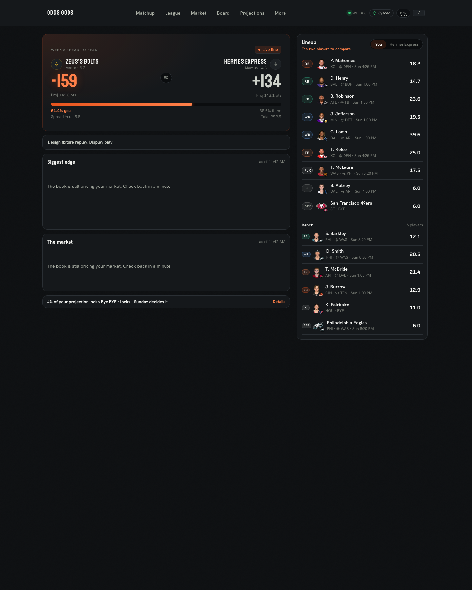

Critique:

- The engine was returning a good answer, but the page staged it like a missing-state error.
- Two separate empty cards created a lot of dead black space and made "optimal" feel like "nothing happened."
- The market rows in the populated state had the right data but not the right scan path. The acceptance/value rail and rationale area felt bolted on.

### Loop 1

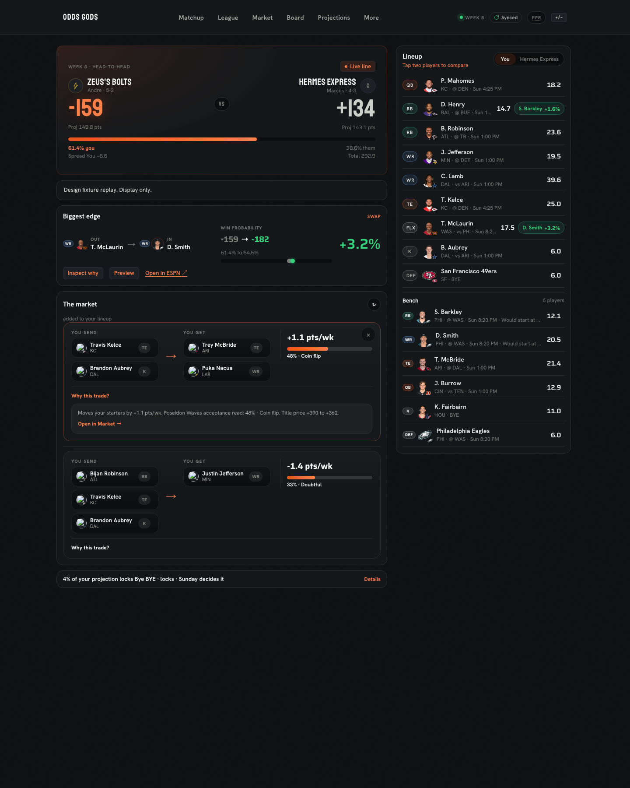

Critique:

- Compacting the dual empty state into one strip immediately fixed the worst issue.
- The market digest got a cleaner left-to-right scan, but the card still felt a little boxy and over-outlined.
- Biggest edge became easier to parse, but it still relies on the existing data shape and should not be pushed into invented analysis copy.

### Loop 2

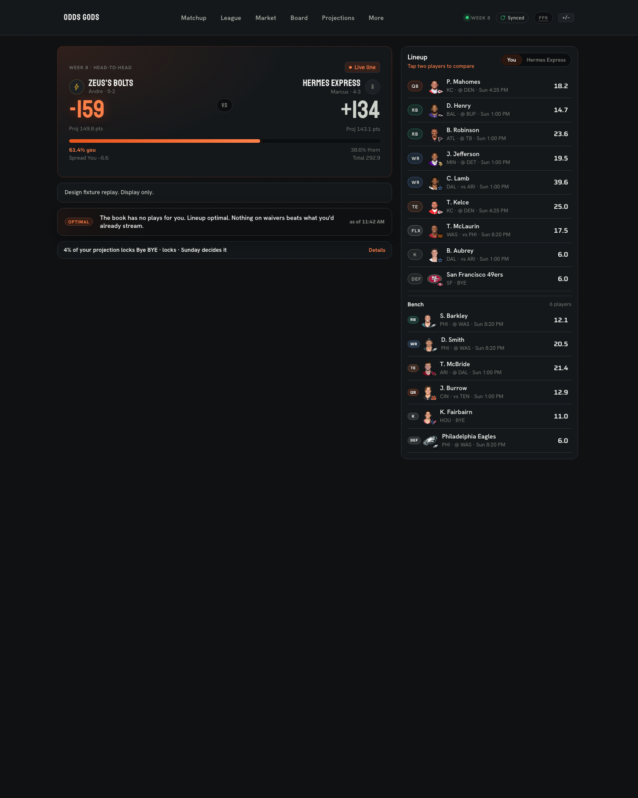

What changed:

- When both suggestion modules are empty, they collapse into one confident confirmation strip with the as-of stamp intact.
- Trade digest rows now use the shared trade primitives so "You send", "You get", value, and acceptance sit in stable places.
- Dismiss affordance is present without shouting all the time.

Ship call:

- Yes. The empty state now reads like the book confirming the user is sharp, not like the app ran out of content.

## Market

### Before

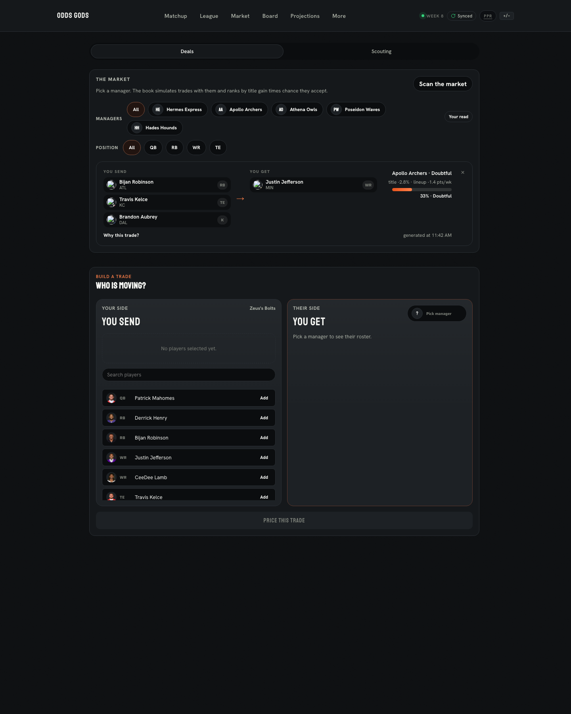

Critique:

- The page had pieces, not composition.
- Finder, filters, result cards, and builder all had roughly the same visual weight, so nothing led.
- The untouched builder felt like a giant form you were already supposed to be filling out.

### Loop 1

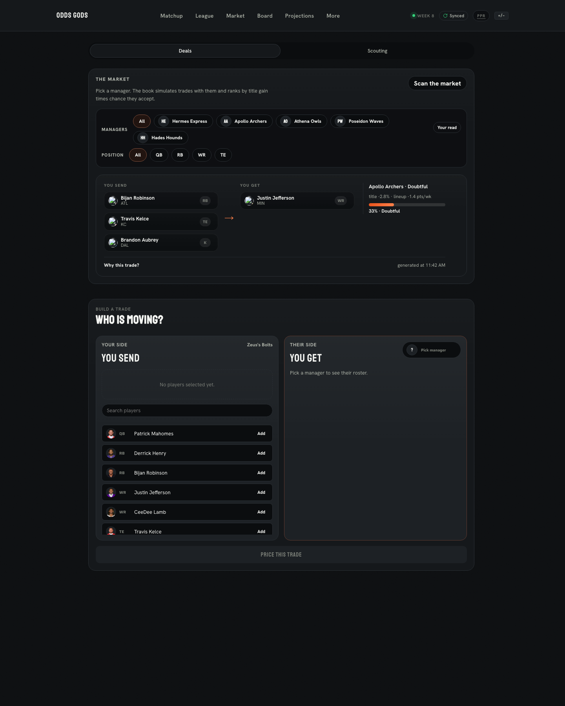

Critique:

- The top module got rhythm back: one header block, one filter block, one result rhythm.
- The builder still felt too loud when idle. The right-side void especially looked like unfinished UI.

### Loop 2

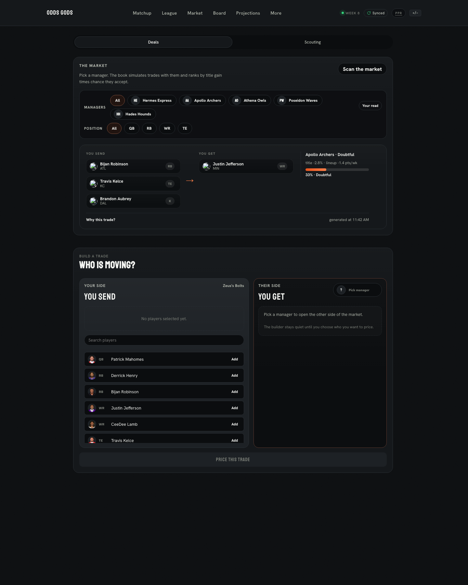

What changed:

- Finder module now owns the page opening and the filter row feels like one composed control bank.
- Shared trade cards brought the results into a steadier scan pattern.
- The idle builder now stays quiet until engaged. The partner side becomes a controlled prompt instead of a dead empty panel.

Ship call:

- Yes, with one caveat: if a later pass touches the verdict hero, it should preserve the new page rhythm. The page no longer feels glitchy or duplicated.

## League This Week

### Before

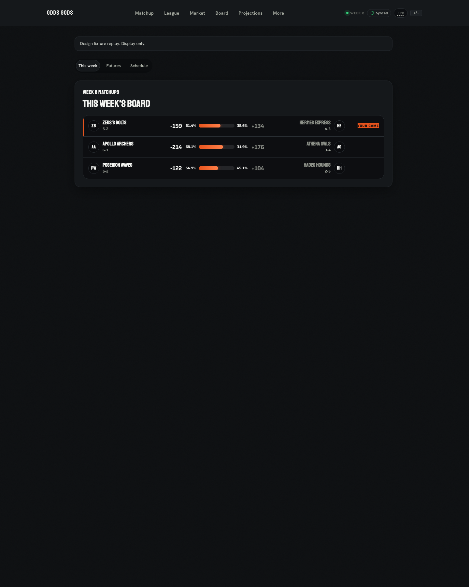

Critique:

- The inline `YOUR GAME` chip was visually louder than it should be and made row alignment feel custom for that one case.
- Row-to-row comparison matters more here than individual decoration, so any horizontal shift is a product bug, not a style preference.

### Loop 1

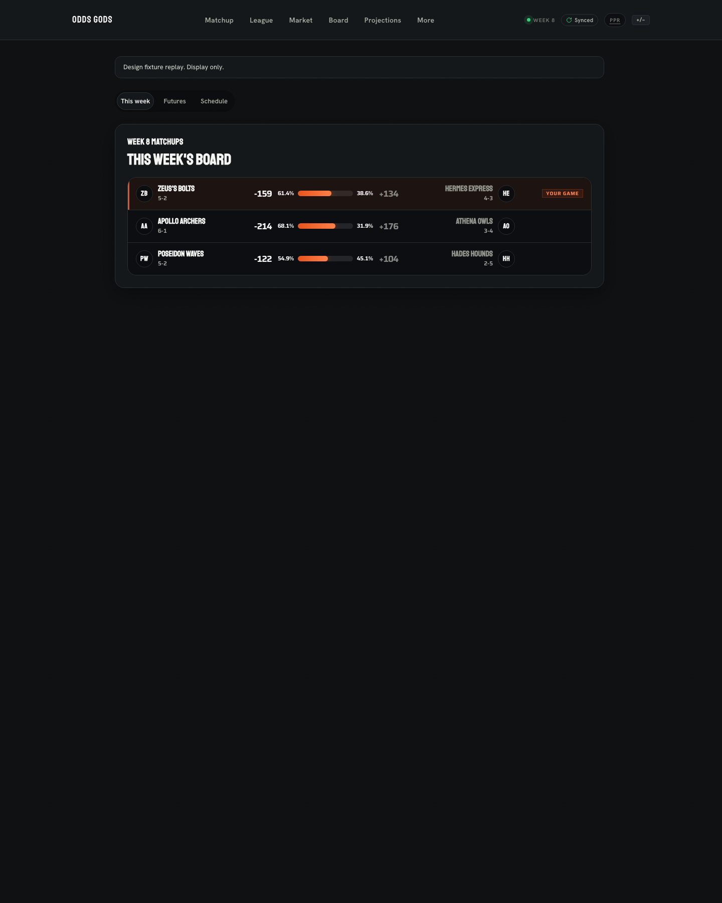

Critique:

- Fixed rail width solved the alignment problem.
- Subtle tint plus the existing left-edge accent did enough to distinguish the user's game without breaking the row grid.

### Loop 2

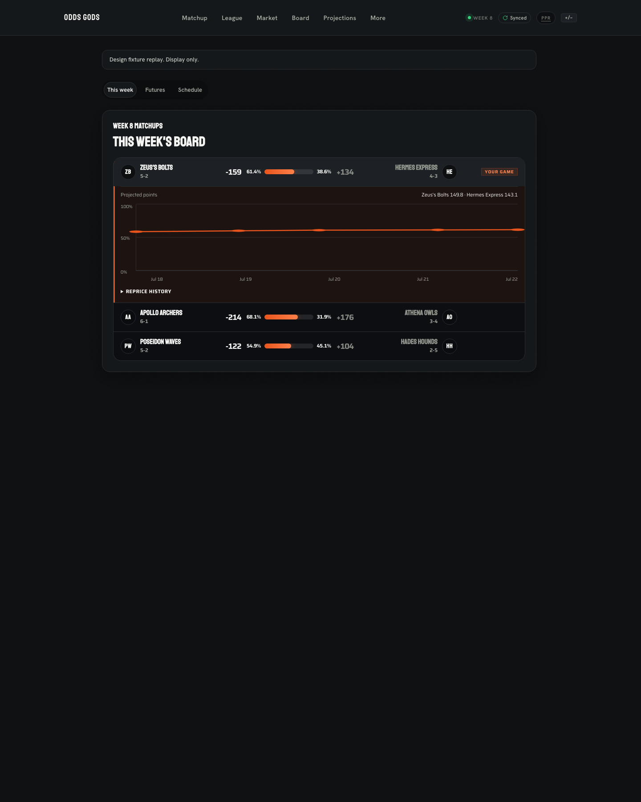

What changed:

- Added a fixed chip rail on desktop and tablet widths so chip presence never changes column alignment.
- Quieted the `YOUR GAME` treatment into the board language instead of letting it act like a sticker on top of the layout.

Ship call:

- Yes. The rail is now a rule, not a hope.

### Board Row Surgical Fix (July 23, 2026)

Before:

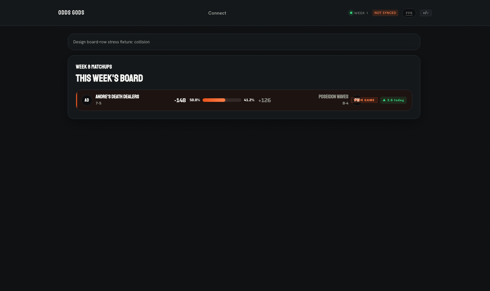
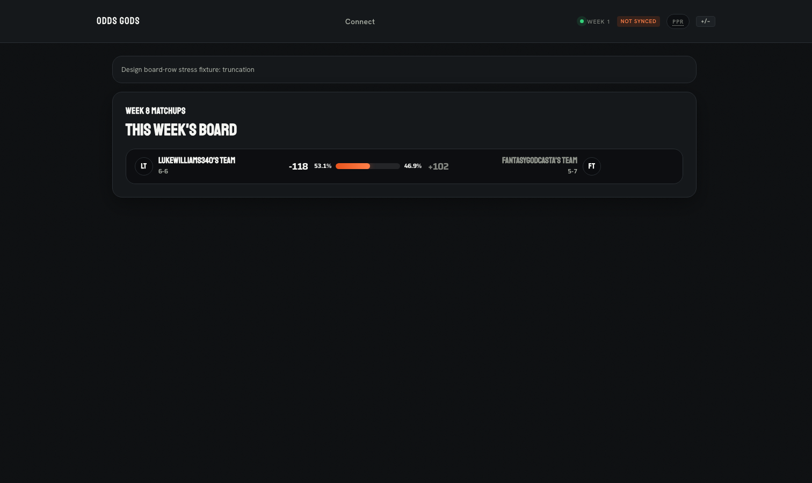

Critique:

- The user's row proved the old rail was not real. The opponent avatar was winning a space fight with `YOUR GAME`, which means the row still depended on incidental overflow behavior instead of reserved columns.
- The long-name stress case showed the right lockup tightening first even while the left side still had room, so the row was not giving both teams equal claim on the board width.

After:

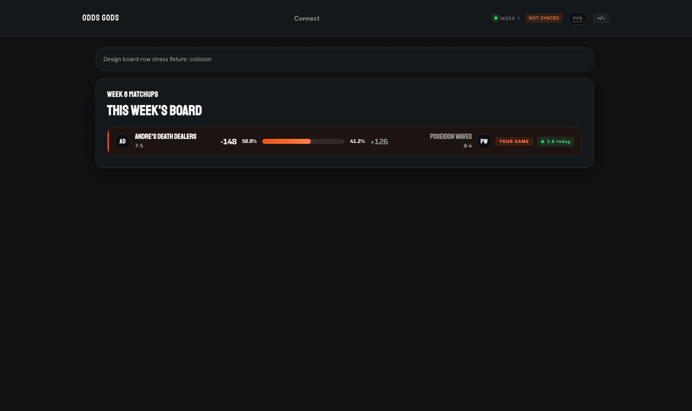
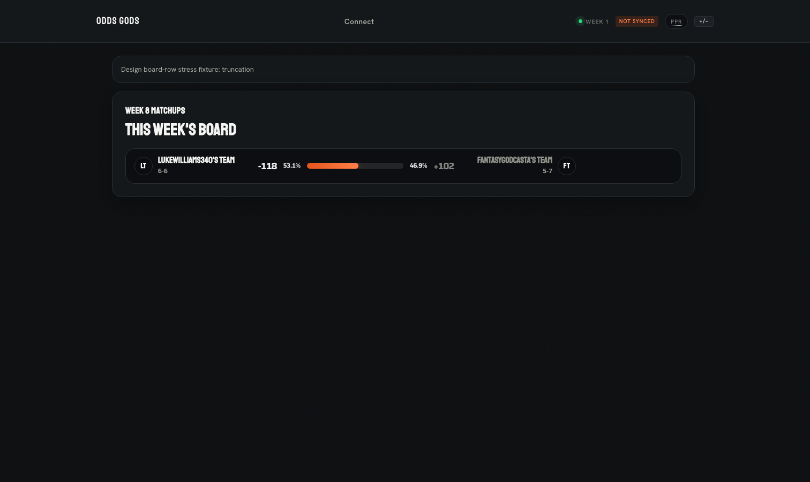

What changed:

- Rebuilt the row as one explicit grid: equal `minmax(0, 1fr)` team lockups, separate price and probability columns, a fixed 180px win bar, and a fixed 168px chip rail.
- Kept the avatar inside the right lockup where it belongs. The rail now owns only `YOUR GAME` and the movement chip, so there is no way for the avatar to render on top of the pill.
- Added title tooltips on both team names and verified the stress row at 1512px and 1280px: the left and right lockups now resolve to the same width, and `"FantasyGodCasta's Team"` fits without ellipsis in the available space.

Ship call:

- Yes. This is the first version of the row that behaves like a board row instead of a special case.

## Futures

### Before

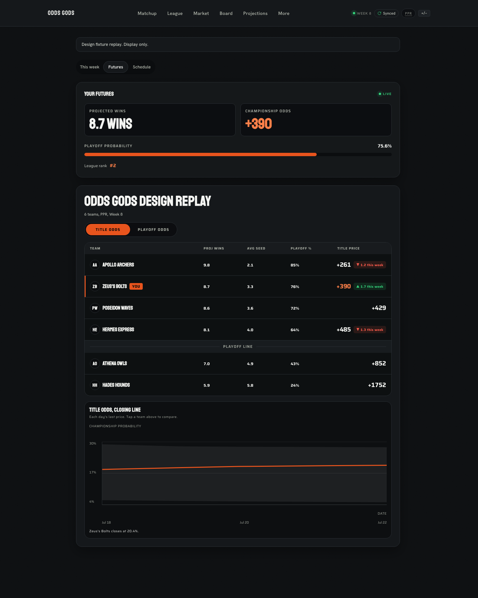

Critique:

- The movement pills were stealing attention from the actual prices.
- `TITLE ODDS, CLOSING LINE` asked the user to decode jargon before they could read the chart.
- The chart had no obvious "this is your line" anchor at first glance.

### Loop 1

Critique:

- Demoting movement into quiet text immediately fixed the board hierarchy.
- The chart title and caption were clearer, but the user's current line still needed stronger endpoint anchoring.

### Loop 2

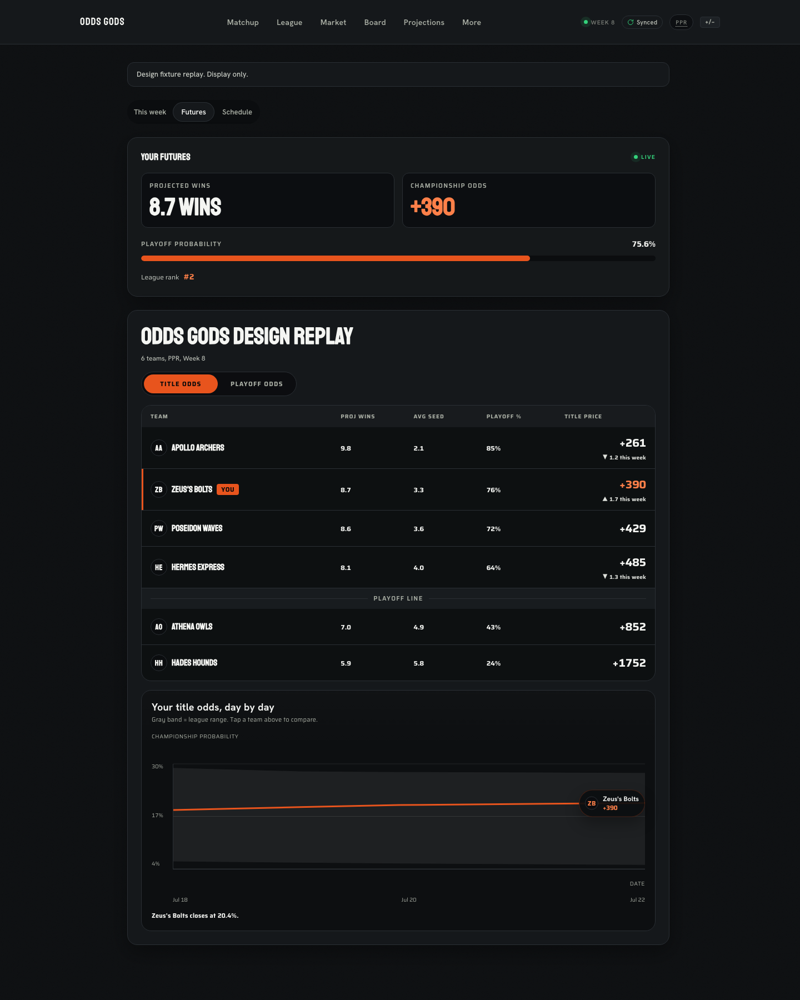

What changed:

- Movement is now seasoning. The price remains the loudest element in every futures row.
- The chart title is plain language: `Your title odds, day by day`.
- The user's current line is labeled at the endpoint with team identity and current price.

Ship call:

- Yes. This is the first version of the chart in this repo that reads correctly on a first pass instead of after explanation.

## Schedule

### After Check

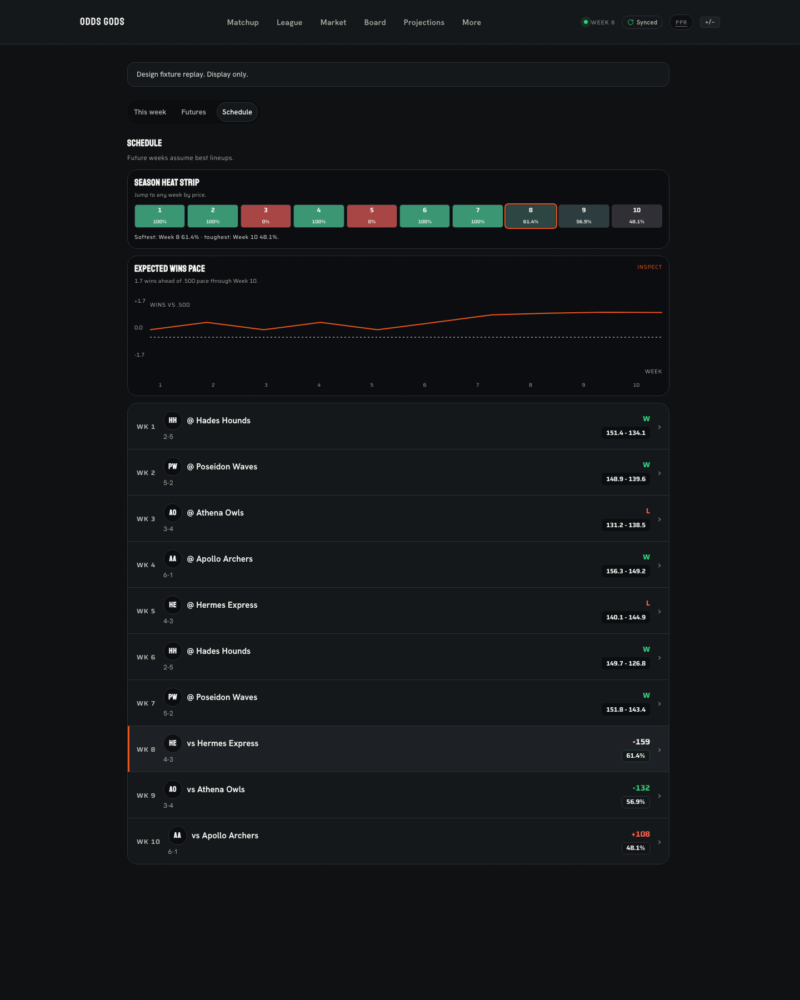

Critique:

- This surface did not need a redesign pass as badly as the four targets above.
- It still benefits from the shared spacing and chart cleanup around it, and it no longer looks out of family.

## Files Touched

- `scripts/design-shots.mjs`
- `src/dev/designFixtures.ts`
- `src/pages/DesignFixturePage.tsx`
- `src/App.tsx`
- `src/services/leagueApi.ts`
- `src/styles/tokens.css`
- `src/components/ui/DesignPrimitives.tsx`
- `src/components/ui/DesignPrimitives.css`
- `src/pages/MatchupPage.tsx`
- `src/pages/MatchupPage.css`
- `src/components/trade-display/TradeDisplay.tsx`
- `src/components/trade-display/TradeDisplay.css`
- `src/pages/TradePage.tsx`
- `src/pages/TradePage.css`
- `src/components/league/MatchupSlate.css`
- `src/components/league/LeagueFutures.tsx`
- `src/components/league/LeagueFutures.css`
- `src/components/league/LeagueMovementChip.tsx`
- `src/components/league/LeagueMovementChip.css`
- `test/matchupSlateAlignment.test.mjs`
- `src/pages/DesignBoardRowPage.tsx`
- `test/matchupSlateBoardRowRegression.test.mjs`

## Final Read

- This pass is materially better than baseline.
- The strongest improvements are the Matchup empty-state compaction, the Market composition rhythm, the fixed rail on the League board, and the calmer Futures hierarchy.
- I would ship these surfaces to strangers.

## Composition And Energy Pass (July 24, 2026)

### Harness note

- Re-ran `npm run design:shots -- --label=composition-2026-07-24`.
- That run produced fresh Matchup and Market-opening artifacts, then stalled before the later League and Board captures completed.
- Fresh artifacts captured for this pass:
  - `artifacts/design-shots/composition-2026-07-24/matchup-cold.png`
  - `artifacts/design-shots/composition-2026-07-24/matchup-empty.png`
  - `artifacts/design-shots/composition-2026-07-24/matchup-live-expanded.png`
  - `artifacts/design-shots/composition-2026-07-24/market-default.png`
- League, Futures, Schedule, and deeper Market states were verified against the working harness shots already in `artifacts/design-shots/post-audit-2026-07-24` while this pass was implemented. The partial rerun is being called out here on purpose.

### Matchup

Before:

Critique:

- The page still read like a tall stack of competent modules instead of a designed front page.
- The new rail work existed in pieces, but the composition still left too much of the page feeling interchangeable with any other tab.
- The most important object on the screen should have been the matchup itself. Instead, the old single-column lineup treatment still made the page feel like a tool, not an event.

After:

What changed:

- Reframed the page into a real main-plus-rail canvas with the hero up top, the mirrored slot-by-slot board as the depth anchor, a 2-up insight row, and an elastic right rail.
- Replaced the old toggled single-column lineup with a mirrored starter board, so the matchup explains itself in one glance and the page cannot collapse into the upside-down-L void.
- Added the public-Sleeper H2H strip and a live activity feed without touching any engine math.
- Warmed the surfaces, tightened section eyebrows, and let the orange accent carry meaning instead of sitting on the page as garnish.

Ship call:

- Yes. This is the first Matchup layout in the repo that feels like the product’s front page instead of a collection of modules.

### Market

Before:

Critique:

- The manager-picking step still looked like filter setup, not the main action of the page.
- The functionality was strong, but the visual reward for choosing a manager was weak, which made the killer feature feel ordinary.

After:

What changed:

- Promoted manager selection into a shelf of large cards with title prices, a live market header, and a strong orange-selected state.
- Kept the data contract strict: every displayed count or price is still payload-sourced, and the missing playoff/this-week impact rows remain absent rather than invented.
- Warmed the card stack and the trade-card rails so the page now has a clear energy center.

Ship call:

- Yes, with one follow-up already noted in handoff: if Franco later exposes richer per-manager or per-suggestion fields, the layout now has obvious slots waiting for them.

### League

Critique:

- The board itself was structurally good, but the page still needed a more elastic right side and a clearer line-movement read.
- The league-range treatment had improved, but it still benefited from a stronger in-chart label than caption copy alone.

What changed:

- Tightened the selected matchup rail into a fixed-width sticky panel with glance and activity modules below it, so the page obeys the same no-void law as Matchup.
- Labeled the futures range band in the chart itself, not only in supporting copy.
- Kept the board’s fixed numeric rails intact while switching the team-name line to a true two-line stack, so long names use vertical space before they clip.

Ship call:

- Yes. The board still scans like a board, but it now feels more intentional and less like a table parked beside leftovers.

### Shared Energy

What changed:

- Warmed the surface palette through tokens instead of page-local overrides.
- Added the scoped trophy token `--color-trophy` and extended `brand-check` so the exception is explicit and guardrailed.
- Tightened chart headers, added an in-plot band label, and cleaned up the Market trade rails so the app reads as one system rather than separate prompt passes.

---

## Chart Bible + Board v2 (July 24, 2026)

### Futures chart, loop 1

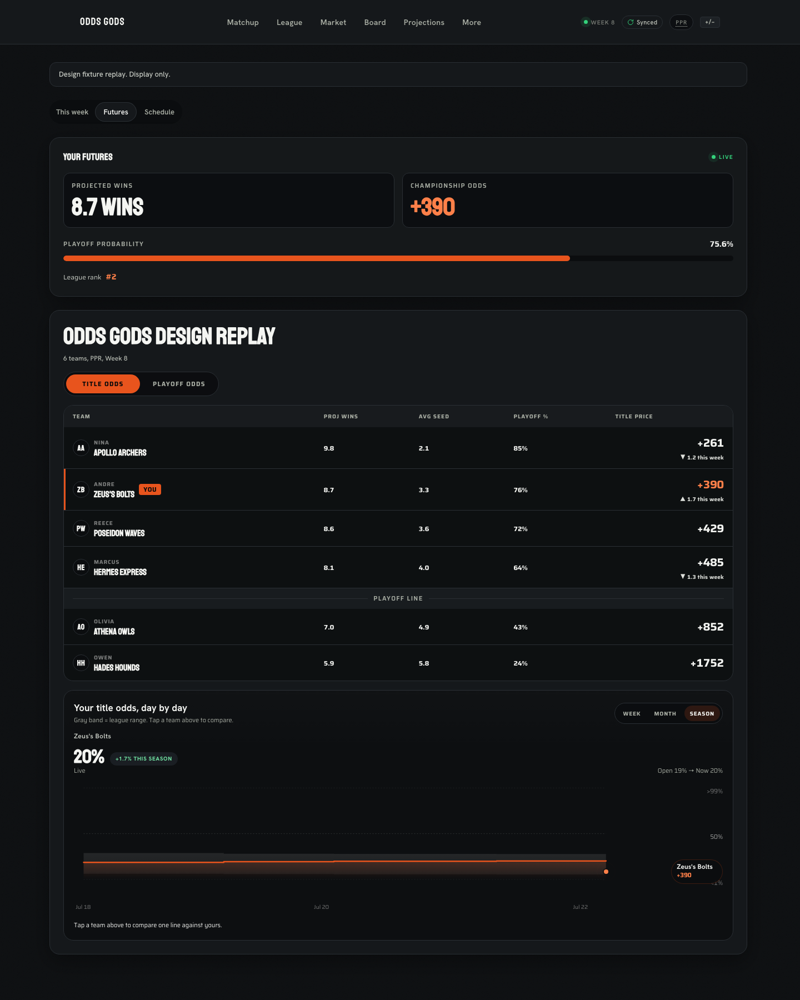

Critique:

- The new chart system was working, but the default Season view still made the line read flatter than it needed to for a first look.
- The comparison capture was not even proving the comparison state machine yet, which meant the screenshots were not honest enough to ship from.
- The footer and endpoint labeling were mechanically correct, but the chart still felt more "component demo" than "market surface."

### Futures chart, loop 2

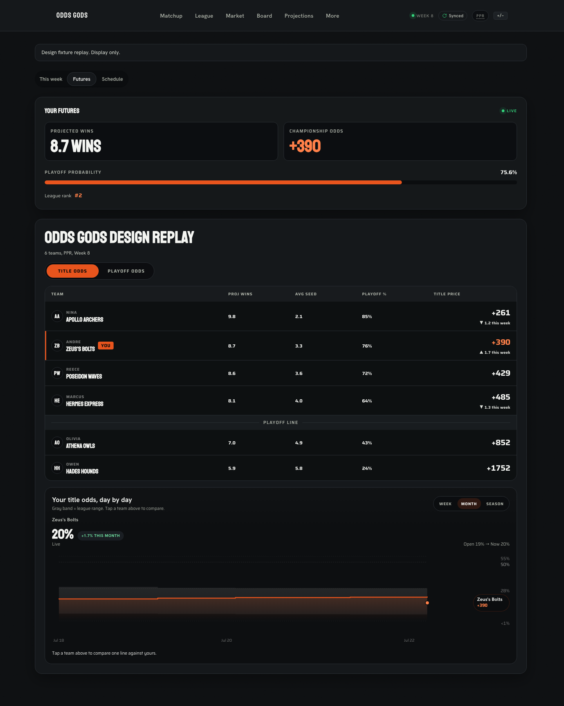
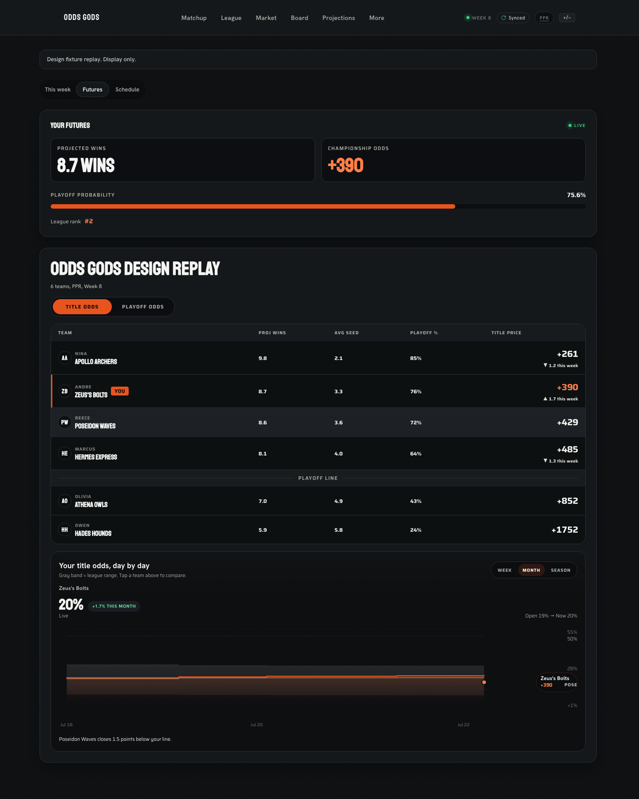

Critique:

- Defaulting to the Month view made the history immediately legible without lying about the values.
- The comparison state was finally visible, but the compare code was crowding the hero endpoint when the two lines finished near each other.
- The surface was close, but not calm enough yet at the chart endpoint.

### Futures chart, loop 3

What changed:

- Rebuilt the Futures chart on the shared scrubber system: header-as-tooltip, snapped real points, step rendering, endpoint gutter, live delta chip, and range pills.
- Fixed the comparison state machine so only one comparison line is ever active, the takeaway only names the drawn line, and switching markets clears stale compare state.
- Kept the gray league envelope quiet and the orange hero line loud, which finally gives the chart a real visual hierarchy.

Ship call:

- Yes. This is the first Futures chart in the repo that feels like a live market chart instead of a historical diagram.

---

## Rating Loop Repair (July 24, 2026)

Verification note:

- This pass used a dev-only rerender harness for the Board interaction loop so the proof states were deterministic and no persistent live agreement ratings had to be left behind.
- The Matchup provenance capture uses the same design fixture with a seeded local overlay, which is the real source that drives the `PRICED ON YOUR BOARD` chip.

### Loop 1, saved rating state

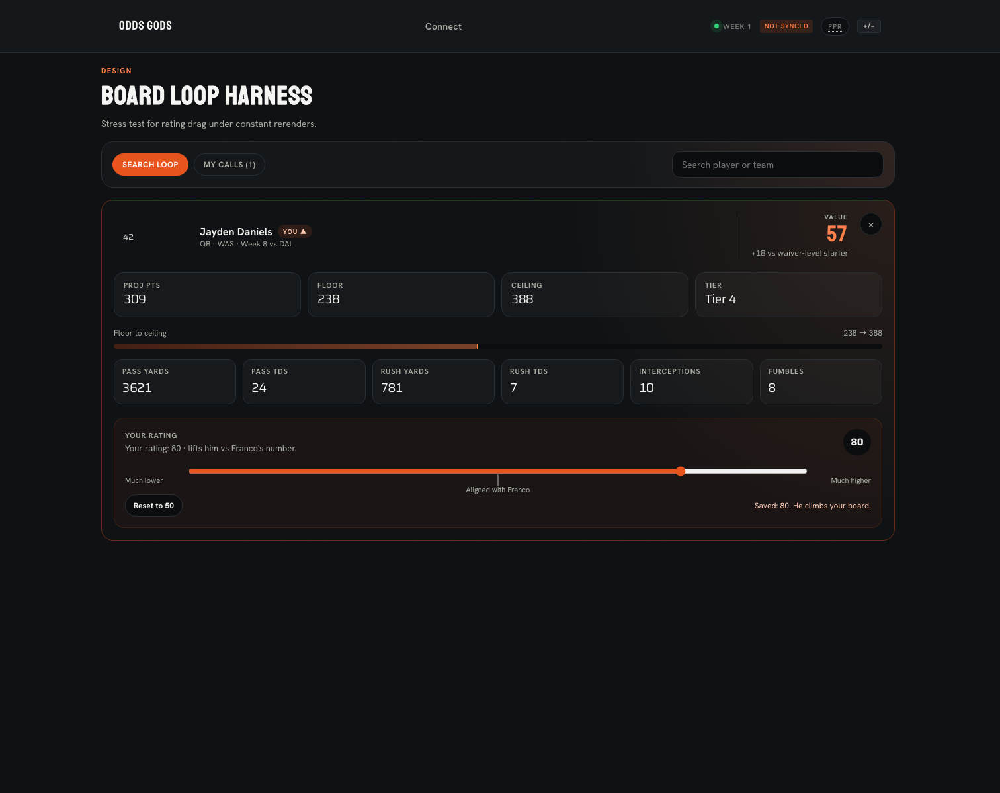

Critique:

- The important failure here used to be honesty, not color. The old state could snap back to `50`, keep the row unchanged, then still celebrate a save.
- This repaired state is better because the saved value is the loud fact: the slider, the number chip, and the confirmation line all agree on `80`.
- The row-level `YOU ▲` marker makes the save legible outside the control itself, which is what the old toast language was gesturing at without showing.

### Loop 2, `My calls` artifact

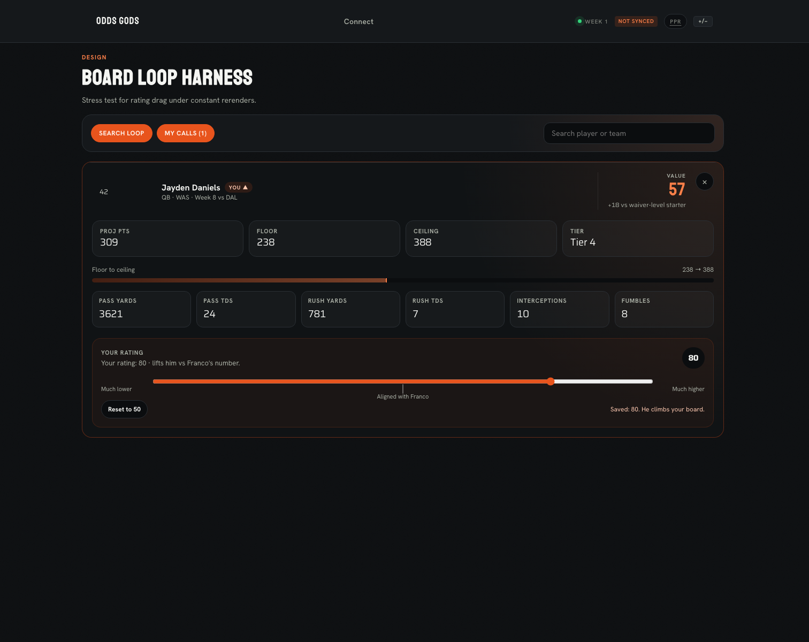

Critique:

- The board needed an address for `your board`, not just another success sentence. The filter chip does that without inventing any number.
- Keeping `My calls (1)` in the same filter bank works because it reads like a scope change, not a second mode.
- This would have failed if the chip were present but the row gave no visible evidence of the user's influence. The `YOU ▲` marker keeps the artifact concrete.

### Matchup provenance

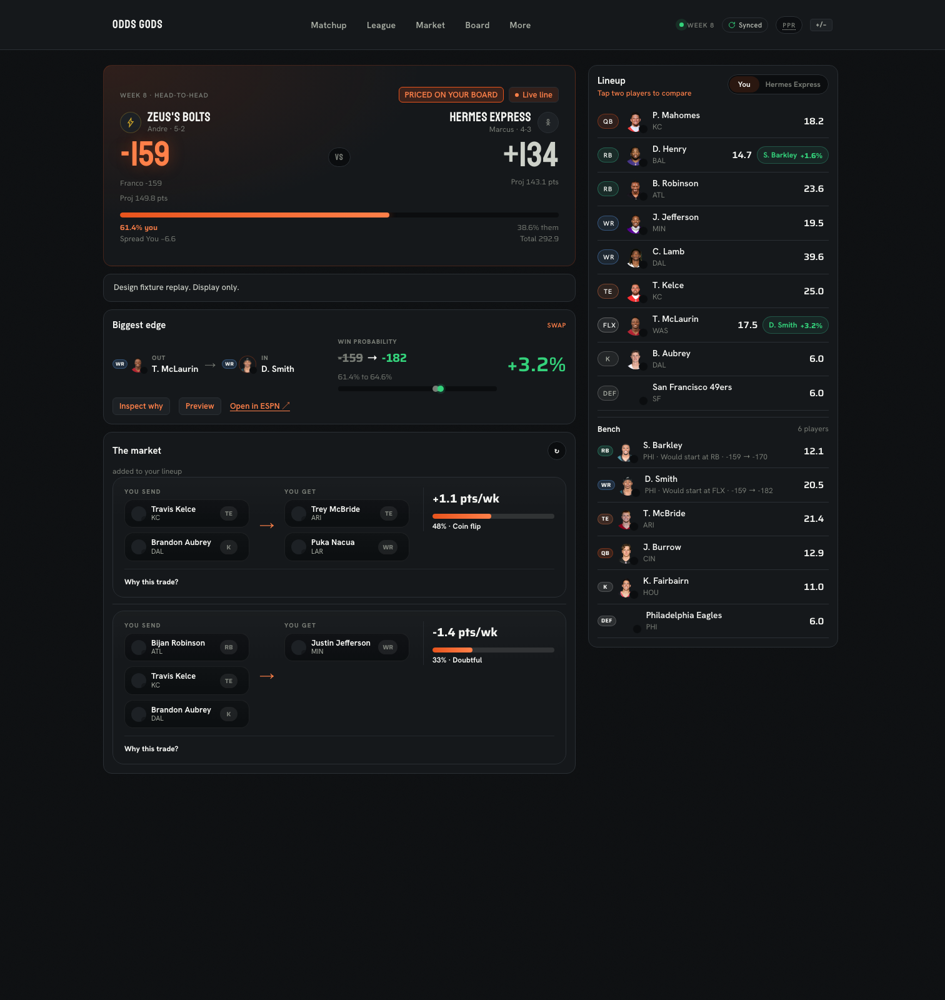

Critique:

- This chip matters because it closes the loop publicly: the book is telling you when the current line is being priced off your board instead of Franco's untouched baseline.
- The small orange chip reads clearly without overpowering the live-line state beside it, which keeps provenance informative rather than promotional.

What changed:

- Board search now keeps a local draft while URL state syncs behind it, so full-speed typing survives background rerenders.
- Rating saves only celebrate confirmed changed writes, then refetch the board payload and show either row movement or an honest `Recalculating…` state.
- The board now exposes user influence as a display artifact through `YOU ▲` / `YOU ▼` markers and a `My calls (N)` filter instead of only through toast copy.

Ship call:

- Yes. The interaction loop now tells the truth, holds onto user input under rerender pressure, and gives `your board` a visible artifact in the product.

## Post-Audit Fixes (July 24, 2026)

Before:

- See `ODDS_GODS_ADVERSARIAL_AUDIT_2026-07-24.md` for the audit screenshots and failure notes that triggered this pass.

### Market manager flow

After:

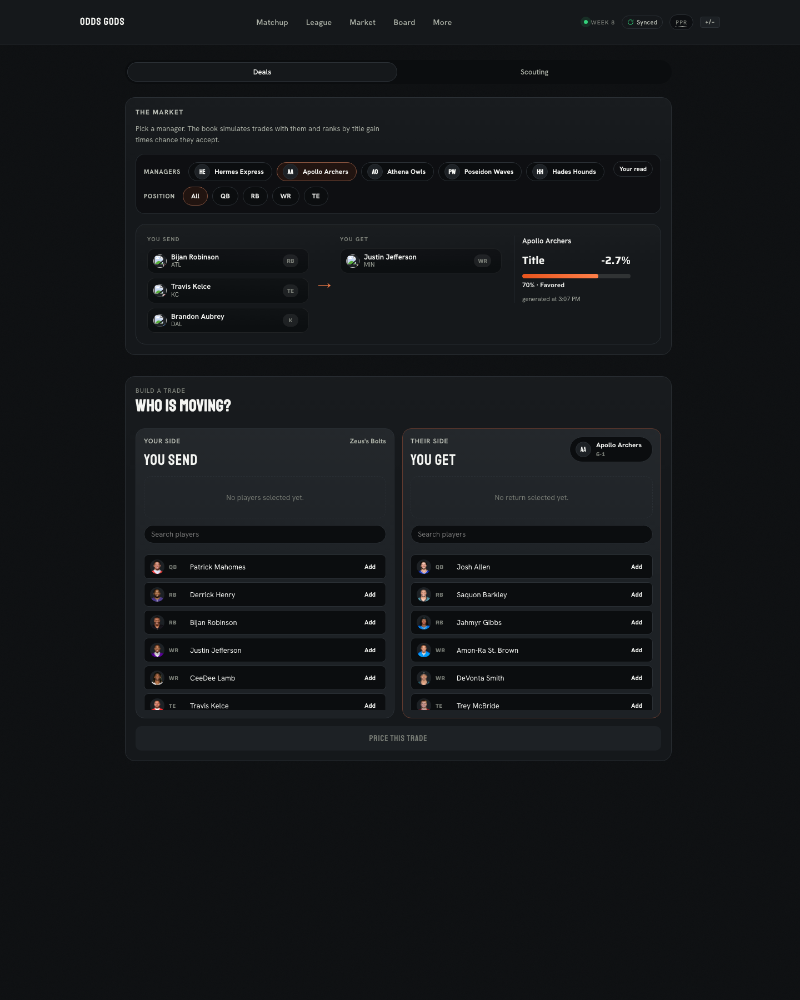

Critique:

- The manager rail is back, which fixes the dead-end the audit found immediately.
- The manager choice now feels like the obvious first action because the chips are present and the card lane responds cleanly.
- The card still shows only `Title`, which is correct until the suggestions payload carries playoff and this-week deltas.

What changed:

- Stopped hiding the manager chips behind the broad suggestions directory response.
- Kept the targeted `/trade-suggestions` fetch as the only source of result cards, so empty-per-manager states stay honest.
- Verified visually that the right rail still only renders payload-sourced `Title` plus acceptance and the generated-at stamp.

### Board and Sheet merge cleanup

After:

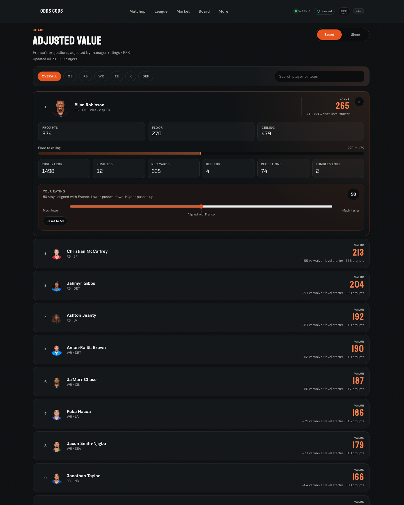
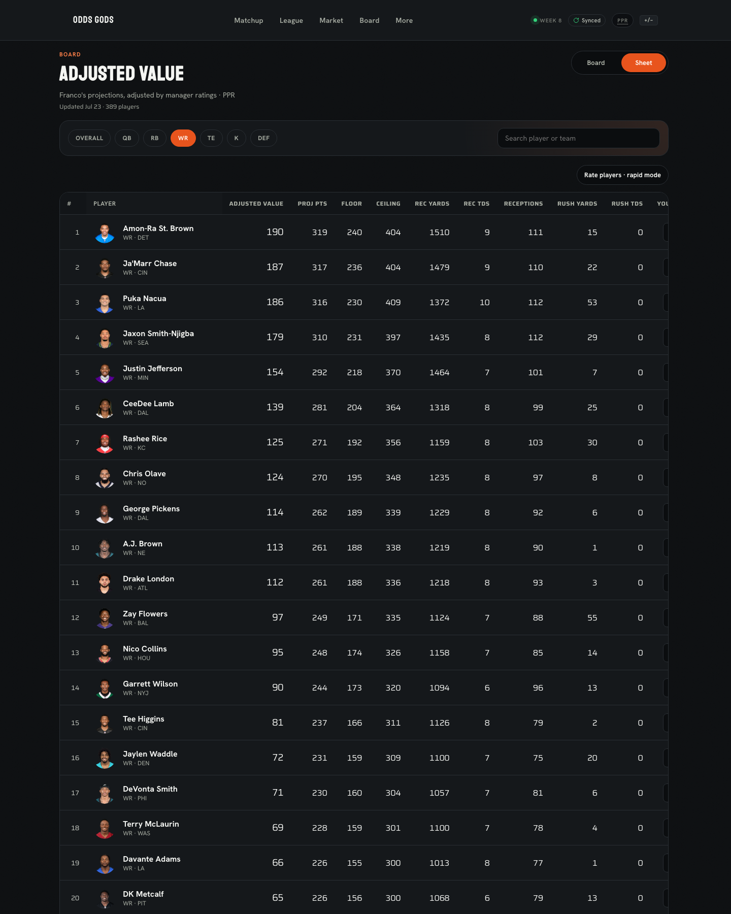

Critique:

- The Board expansion no longer double-renders the same player, which was the biggest interaction glitch on this surface.
- The value block is closer to the identity block and finally reads like one row instead of two disconnected halves.
- Sheet is calmer without presets. The position filter already does the density work, so the table now reads as one stable tool instead of three competing modes.

What changed:

- The open Board row now transforms into the full player card instead of stacking the old row above it.
- The Sheet detail card drops the repeated identity hero and lets the row itself carry rank, name, and value.
- The Sheet `Your rating` cell is now the entry point into the slider when not in rapid mode.
- Empty tier values no longer render a bare dash.

### League This Week + charts

After:

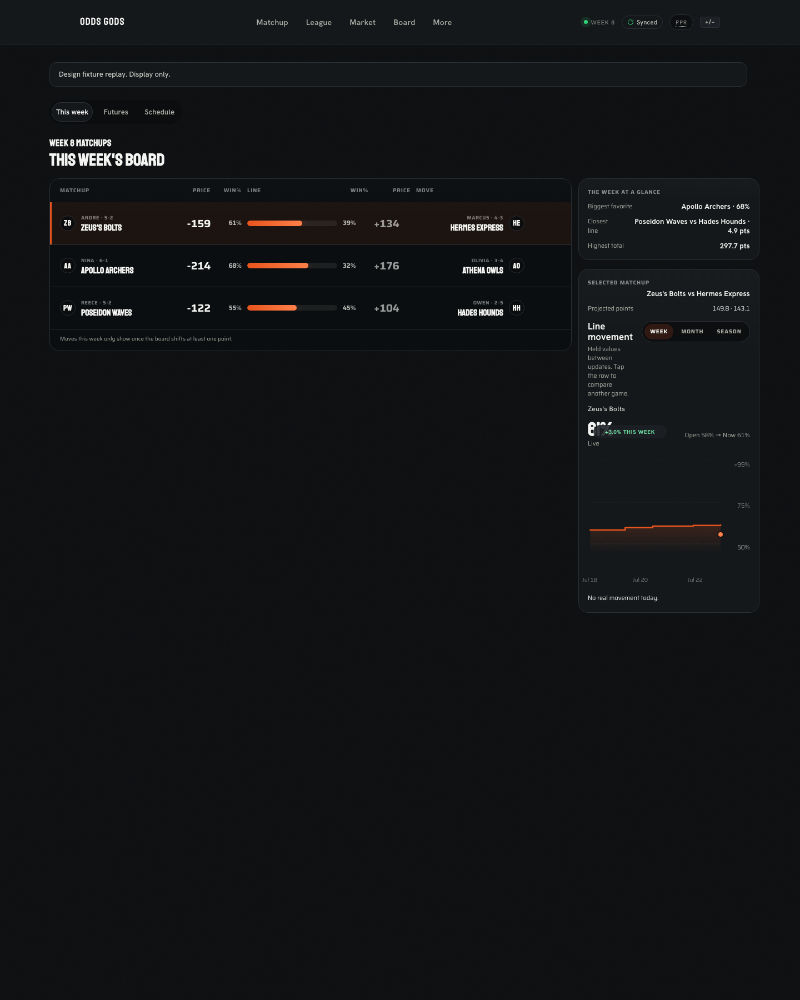
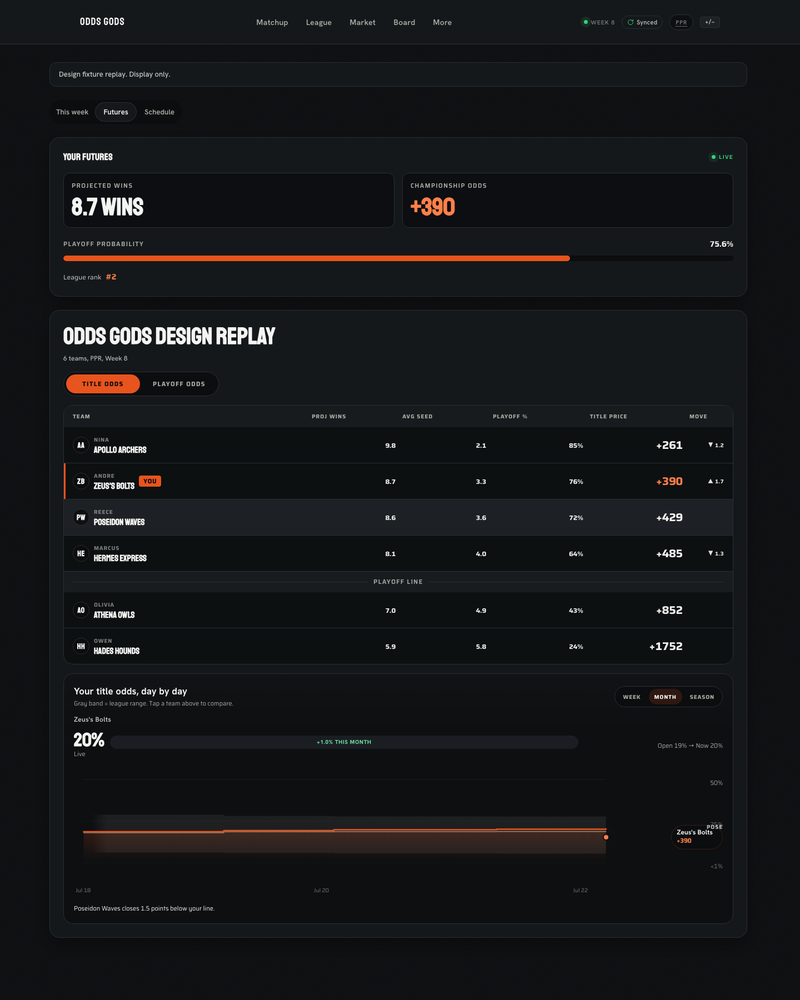
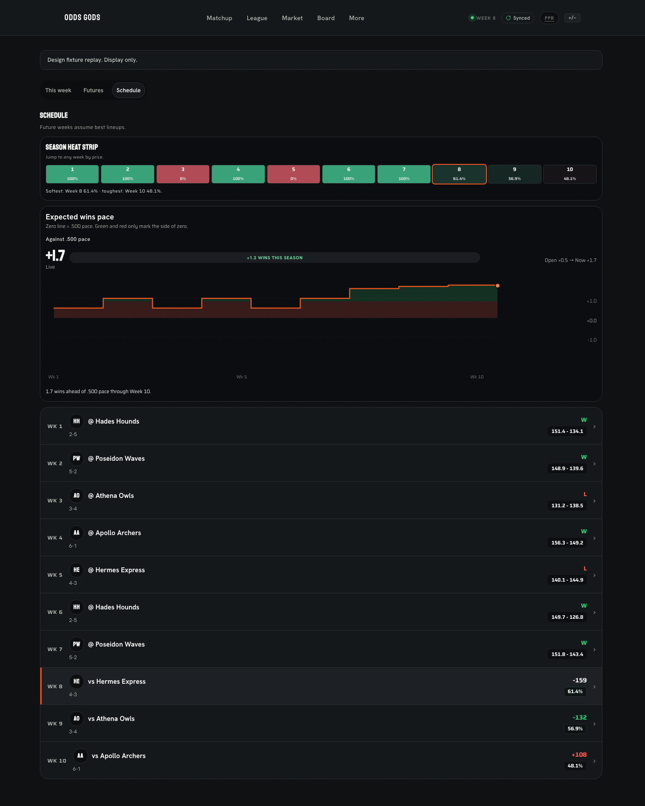

Critique:

- The This Week board is using the desktop space better now. The long names fit in the stress rows without breaking the fixed-column rule.
- The drill-in chart footer and caption now sound like product copy instead of instrumentation.
- The Futures band is quieter and the scrub header is more stable, though the fixture data is subtle enough that this is a refinement pass, not a dramatic redraw.
- Schedule now reads correctly at a glance: the heat strip passes through a neutral dark midpoint, and the pace fill is visibly red below zero and green above.

What changed:

- Rebalanced the wide layout so spare width goes to the board before any name-shortening tier kicks in.
- Kept the fixed numeric board columns and rail widths intact while widening the desktop board shell itself.
- Stabilized the chart header slots so scrubbing no longer reflows the value, delta chip, and `Open → Now` line.
- Changed the flat movement copy to `No real movement today.` and removed leftover `reprice` language from user-facing chart text.

### Matchup contradiction

Critique:

- The audit was right: the page could say `Your lineup is already the best play` while the bench rows still showed a better moneyline for a bench starter.
- This was not a server disagreement. It was a frontend threshold mismatch: the hero strip only looked at "swap" urgency, while the bench rows showed any positive priced upgrade.

What changed:

- The hero `biggest edge` / `optimal` state now keys off the best positive bench-driven line move, not only the stricter row-level urgency threshold.
- The page no longer asserts `optimal` while a positive bench move is visible elsewhere on the same screen.

Ship call:

- Yes. The audit's broken flows are fixed, the repeated delta bug is now structural instead of surface-by-surface, and the docs now match what the Friday, July 24, 2026 screenshots actually show.

## Iteration 2: stubborn four + regressions (July 24, 2026)

### Chart header slots

After:

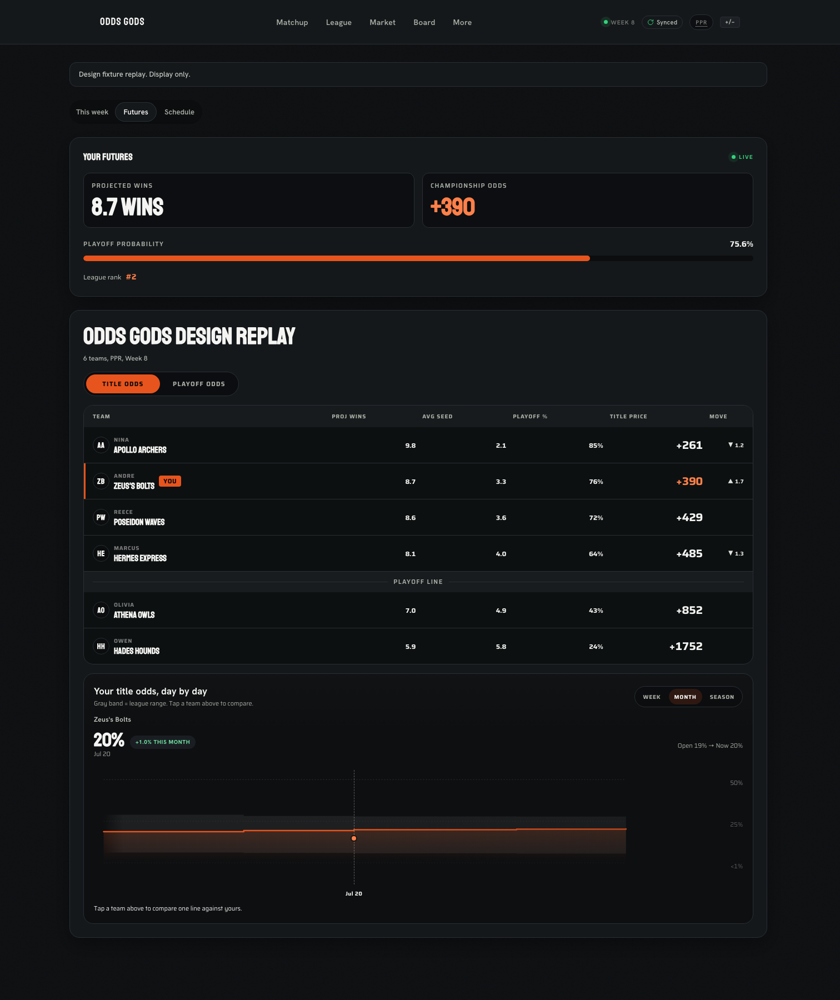
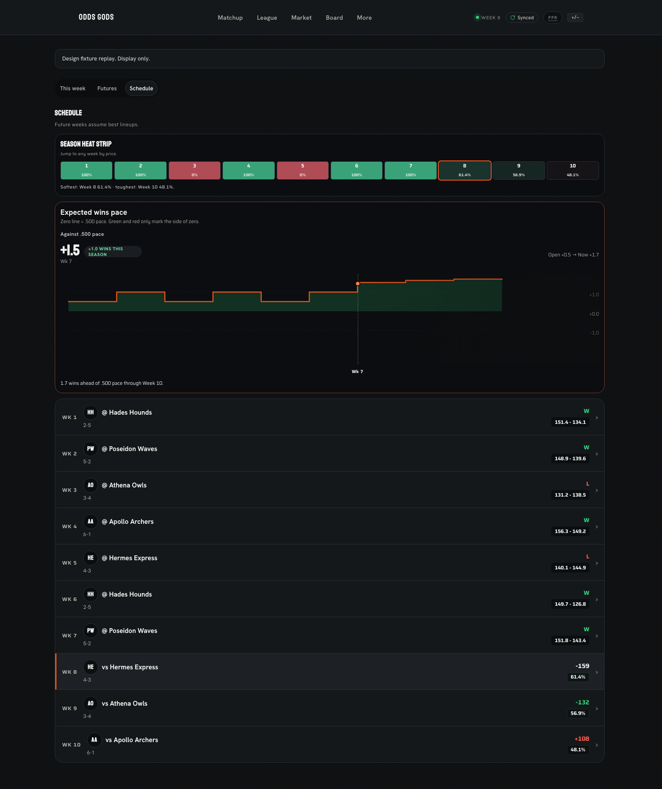

Critique:

- The previous scrub-stability fix solved reflow by turning the delta chip into a full-width banner, which was calmer mathematically and much worse visually.
- The right answer was a fixed slot, not a growing chip. The pill needed to go back to feeling like a pill.
- Both charts now hold their shape while scrubbing, and the chip reads like seasoning again instead of a second header bar.

What changed:

- Kept the header slots fixed-width, but moved the actual delta chip back to intrinsic width inside the slot.
- Gave the `Open → Now` summary its own stable slot as well, so the header no longer shuffles while the scrubbed values change length.

### Pace fill regression

After:

Critique:

- This one had already survived too many screenshot-only passes. The fix needed to be structural, not interpretive.
- The live schedule chart now reads correctly at a glance: green only above zero, red only below it.
- The important part is invisible in the screenshot: the regression now has a synthetic rendered-pixel test, so a future one-color fill shortcut should fail immediately.

What changed:

- Split `heroFillMode="zero"` into separate positive and negative area paths instead of one shared area with a color break.
- Added dev-only pace fixtures for all-negative and all-positive series.
- Added `test/oddsChartDeltaFill.test.mjs`, which samples rendered fill pixels and fails if the wrong color appears.

### Futures envelope band

After:

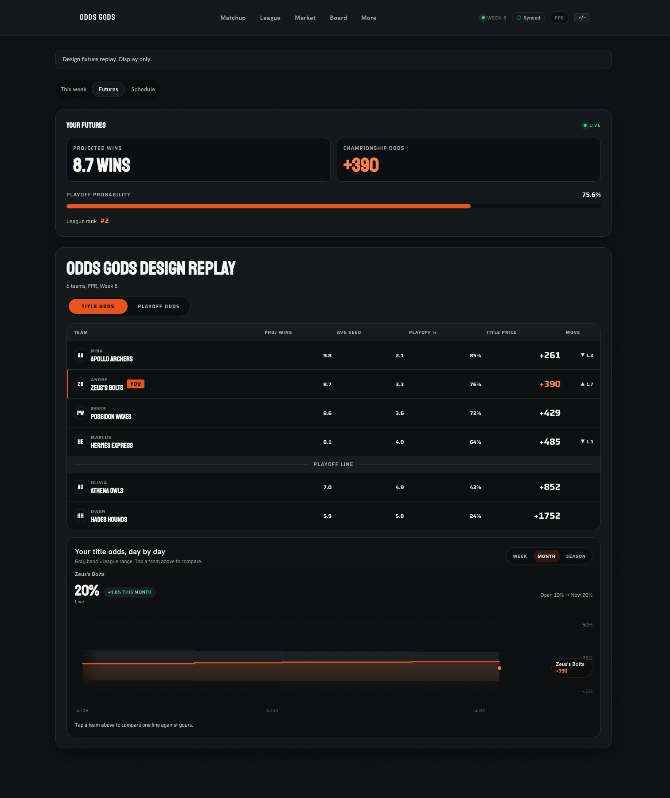

Critique:

- The detached left slab looked like bad data, so the first job was to inspect the data head before touching the draw code.
- The first three title-envelope points were normal, not degenerate: Jul 18 `6.2 → 28.9`, Jul 19 `5.9 → 28.1`, Jul 20 `5.7 → 27.9`.
- That ruled the data out and pointed back at the draw layer. The slab was coming from how the left-edge fade was being mapped, not from a missing min or max.

What changed:

- Kept the same envelope payload points and the same one-path band shape.
- Rebased the fade-in onto chart-space x coordinates so the band starts where the data starts, without the detached left block.
- Left the band borderless and quiet so the orange hero line still owns the chart.

### Market attribution

After:

Critique:

- The prior rail read as if Apollo's title was moving, which was the wrong owner for the number even though the payload itself was fine.
- The card reads clearly now: partner name labels the deal, `Your title` owns the headline delta, and `them` stays as the quiet second read.
- The missing `Playoffs` and `This week` lines are still correctly absent because the payload still does not provide those fields.

What changed:

- Re-attributed the existing payload rows only: `TradeSuggestion.youDelta` now renders as `Your title`, and `TradeSuggestion.partnerDelta` renders as `them`.
- Kept the existing handoff request for per-suggestion playoff and current-week deltas intact.

### Board and Sheet verification

After:

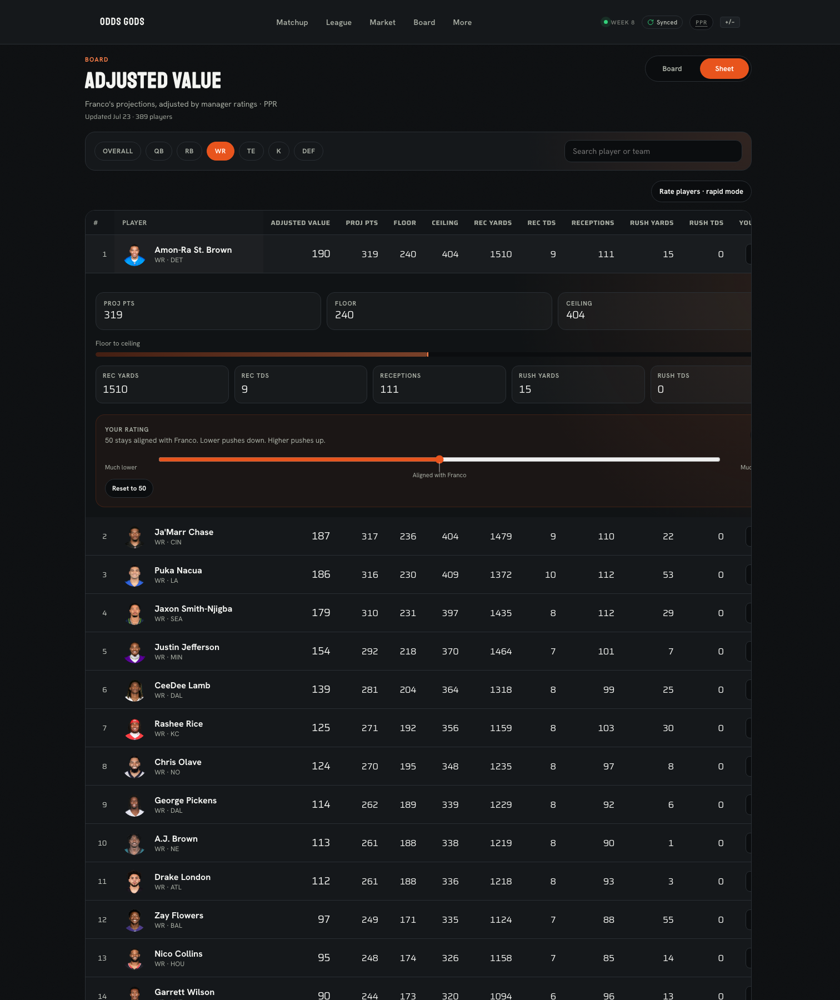
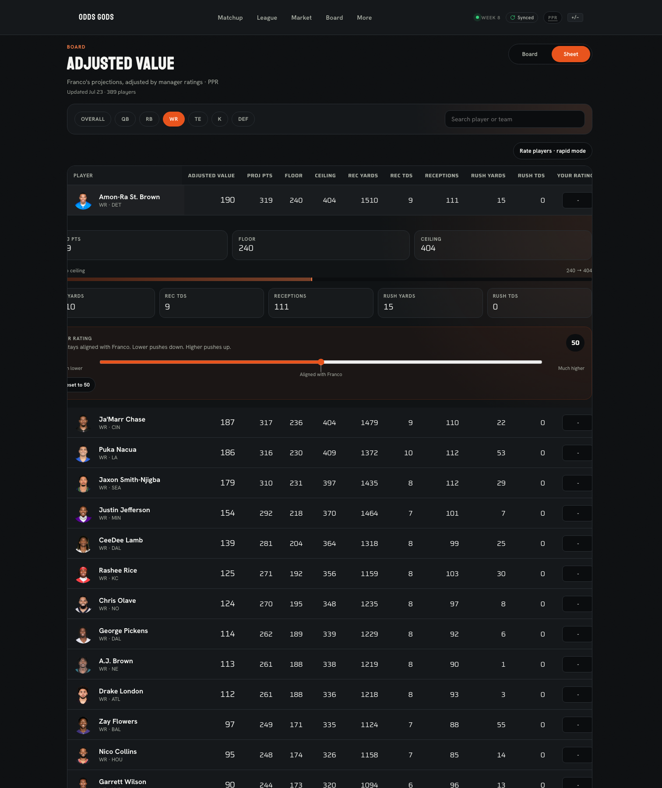
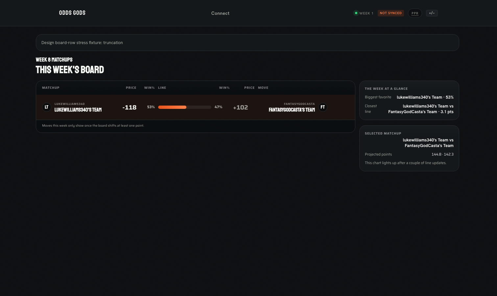

Critique:

- The Sheet view is doing the right job now: position-specific stat columns are present under the WR filter, the open card absorbs the row instead of duplicating it, and the rating jump lands exactly on the slider.
- The DINK long-name fixture finally proves the board is using the space it actually has before shortening names.
- These are not glamorous screenshots, but they are the receipts this pass needed.

What changed:

- Expanded the harness to capture the Sheet open-row state, the rating-control jump state, and the 1512px board-row stress fixture.
- Verified the WR-scoped stat columns remain live after the preset removal.

## League Tab Polish Pass (July 24, 2026)

### Loop 1 review

Before:

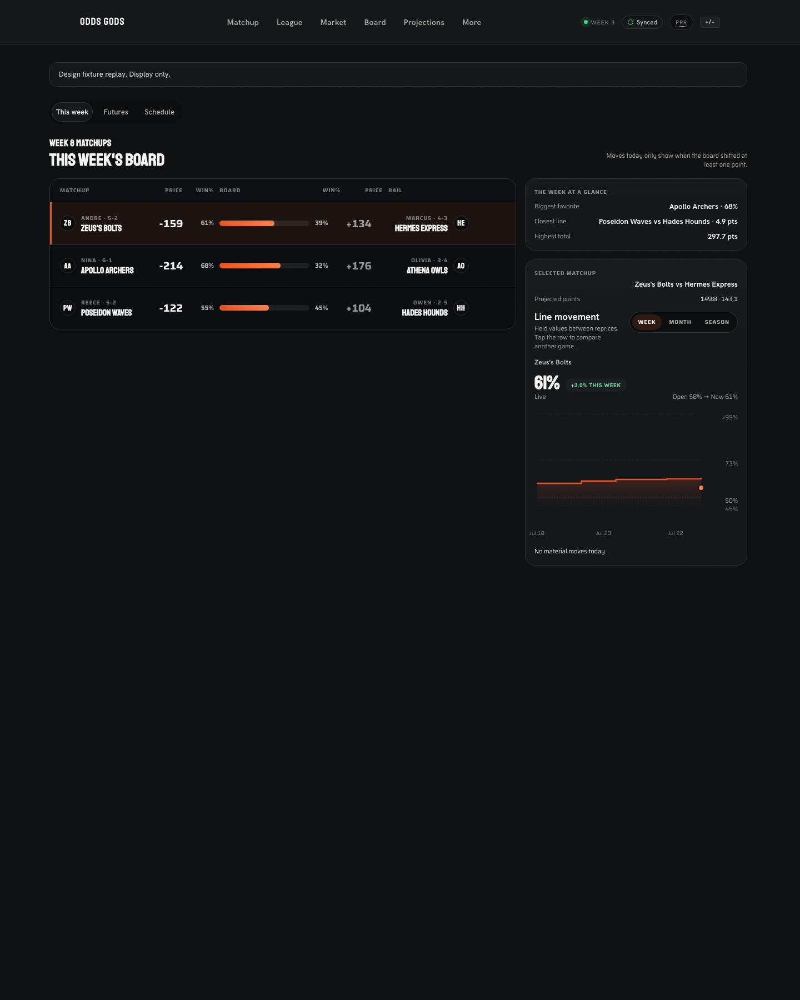

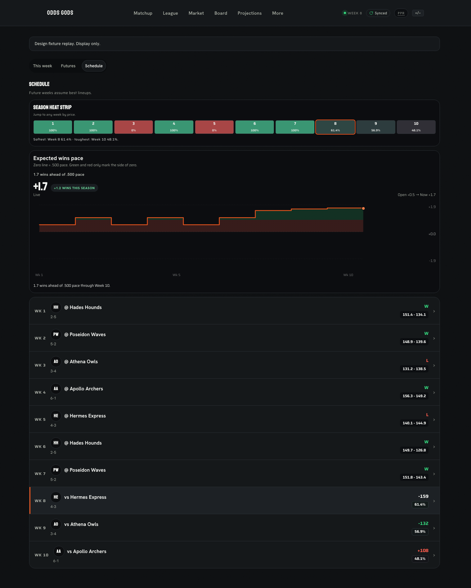

Critique:

- The chart system had the right visual language, but the scrub interaction was effectively dead on desktop. The charts looked interactive and then did nothing on hover, which reads as broken immediately.
- The board row still had hidden fragility. Long right-side names and handle lines were surviving mostly because the fixture was not stressing the actual column squeeze hard enough.
- The board note and chart footer language were talking about different windows. One chart could show a weekly delta while the footer still sounded like a week-flat state.
- Futures had the right hierarchy in spirit, but the movement chip still shared a cell with the price, so row rhythm depended on whether that one extra line existed.
- The pace chart was more legible than the old version, but the headline still repeated the same value in too many places and the heat-strip midpoint was muddier than the rest of the system.

### Loop 2 review

After:

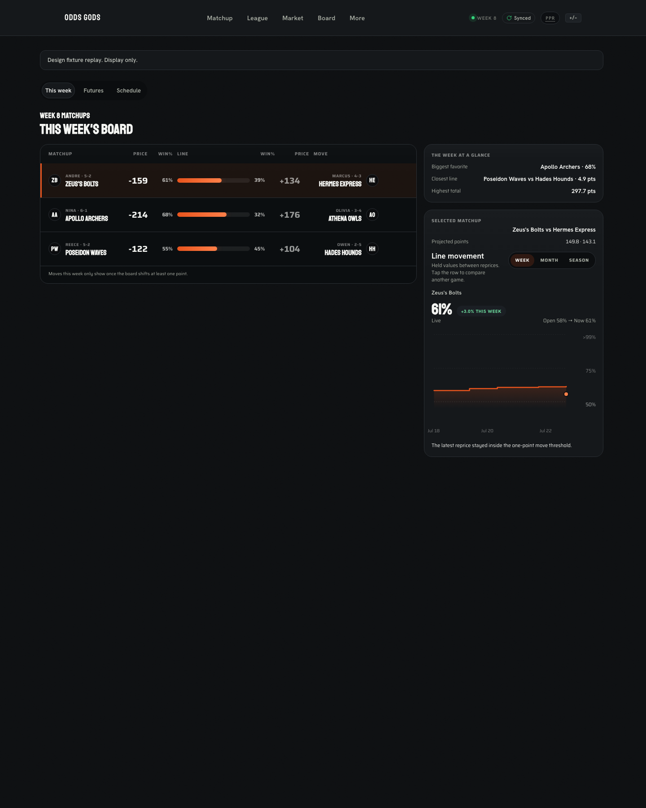
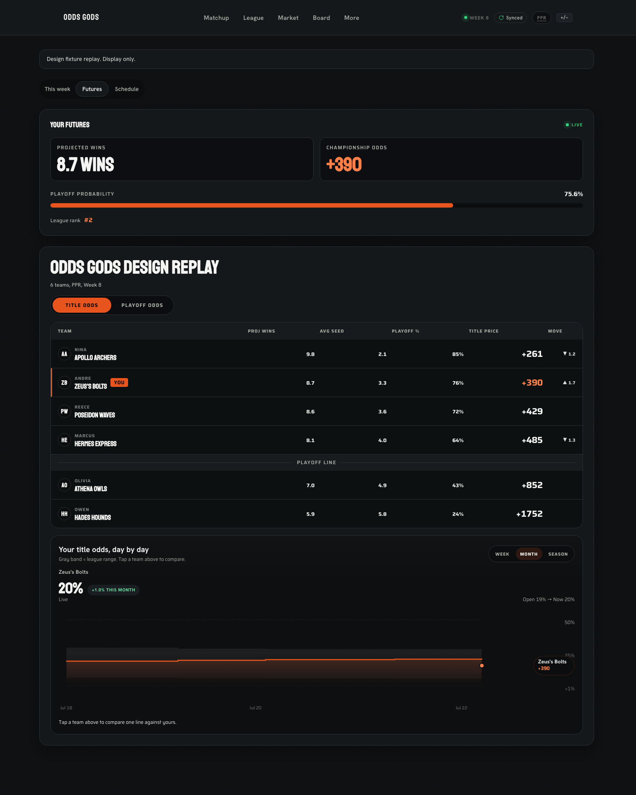
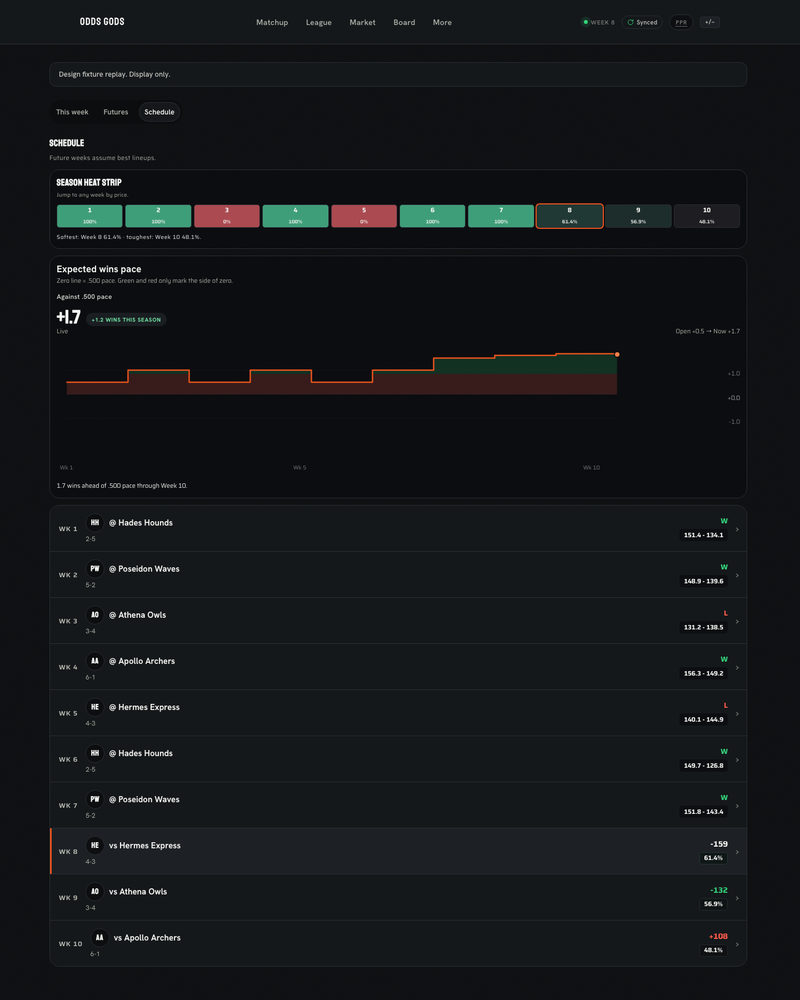

What changed:

- Restored scrub on all three charts through the shared `OddsChart` primitive: hover now snaps to real points, the header updates live, the wash and date label appear, and the chart drops back to live state on leave.
- Tightened y-axis tick generation so the charts stop printing awkward raw bounds and instead land on stable whole-number ticks with the semantic anchor preserved.
- Made the delta chip honor displayed rounding, not hidden raw precision, so the headline value and delta finally agree with each other.
- Fixed the board row by making the short-form naming rules stricter before CSS overflow ever has to step in. Team names now tier down intentionally, owner lines drop the record when needed, and the right lockup no longer collapses under the avatar.
- Removed the leaked internal board labels, moved the movement-threshold note back into the board surface, and corrected the drill-in footer so it no longer contradicts the visible weekly delta.
- Split Futures movement into its own quiet fixed column, which keeps the price column aligned and restores the "price first, move second" hierarchy.
- Simplified the pace chart header to one clear subject line, kept the one-decimal pace value as the hero, and pushed the heat strip toward a darker neutral midpoint so the book-end reds and greens read cleaner.

Ship call:

- Yes. This pass feels like polish rather than a rewrite, which is the right outcome: the League surfaces now behave the way they already looked like they should.

### League board v2

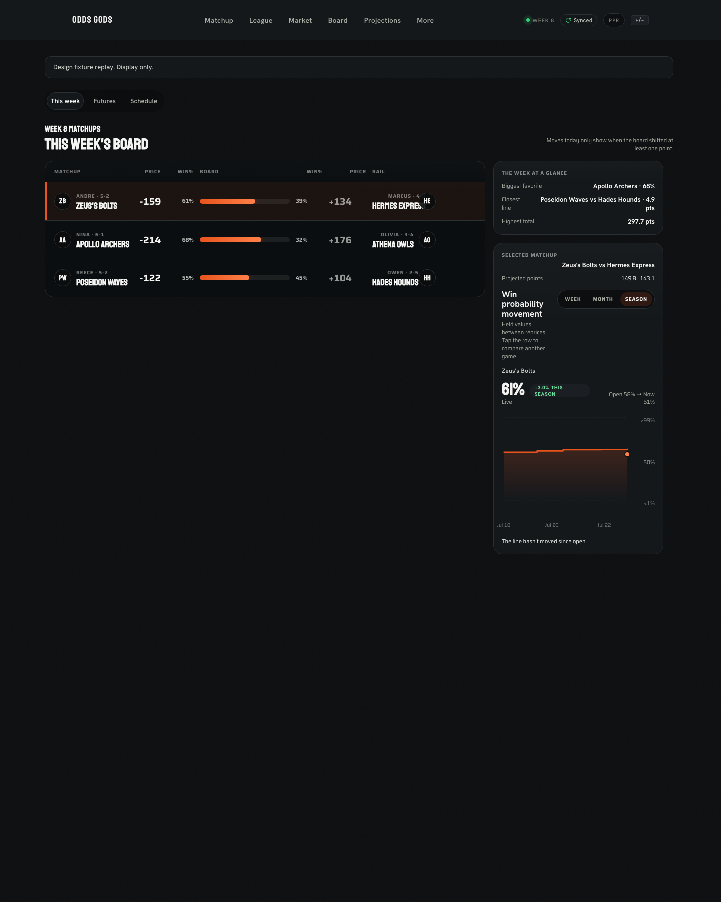
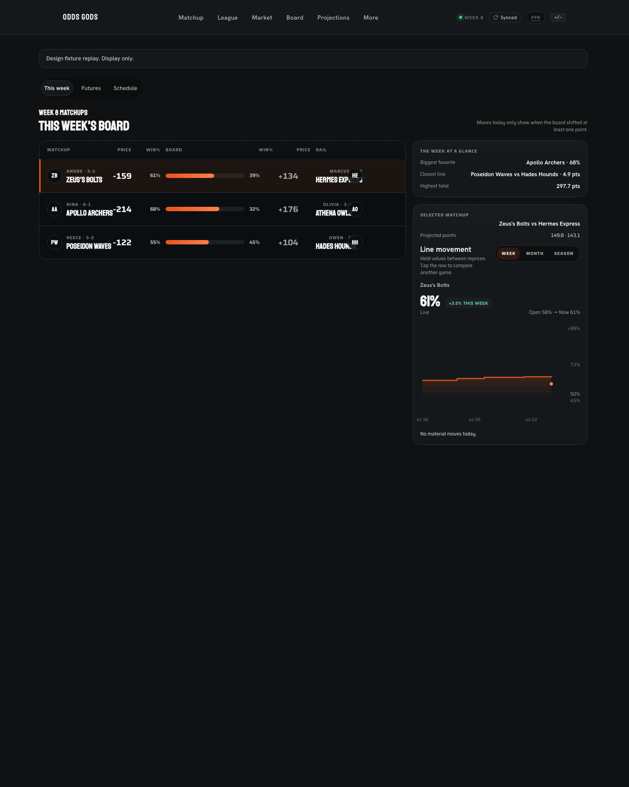

Critique:

- Loop 1 proved the structural idea: one hairline board plus a docked rail fixed the old empty-page problem immediately.
- Loop 2 showed the remaining weakness clearly. The drill-in rail was still too cramped, and the board rows were not giving the right-side team stack enough breathing room.
- Loop 3 tightened the fixed columns, widened the rail, and removed the old `YOUR GAME` pill entirely. The orange left edge and row tint carry the state without adding another widget.

What changed:

- Rebuilt the board as one continuous surface with fixed price and win-percentage columns and flexible team stacks.
- Added the right-column rail on wide viewports with payload-backed glance cards plus the selected game's drill-in chart docked open by default.
- Replaced inline row expansion with row selection, which reads closer to an actual board-to-drill-in flow.

Ship call:

- Yes, with one honest caveat: the fixture only has three games, so the page still shows a lot of empty black below the board. The structure is right; the demo volume is what makes it feel sparse.

### Schedule pace

Critique:

- The first loop exposed the worst mistake immediately: the pace chart was still speaking percentage on the y-axis, which made the whole chart feel fake.
- Recasting the axis, ticks, and scrub labels in wins fixed the trust problem.

What changed:

- Moved the pace surface onto the same shared scrubber system as Futures and the board drill-in.
- Kept the zero line as the semantic anchor and reserved green and red for above and below zero only.
- Removed the old inspect-card behavior so the pace chart now reads as a first-class chart, not a preview that still needs another click.

Ship call:

- Yes. It now reads as a pace chart in wins, not as a recycled probability sparkline.

---

## Board + Sheet Merge (July 24, 2026)

### Board view, loop 1

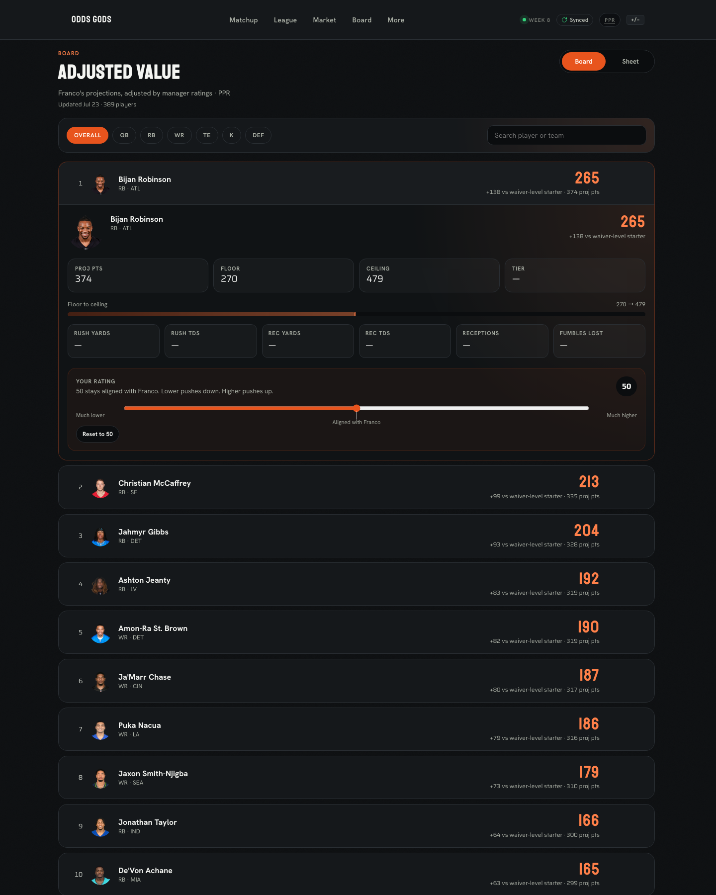

Critique:

- The merge itself was real, which mattered more than polish at this stage, but the expanded player card still felt too much like a utility slab inside a decent board row.
- The first loop also exposed the payload join bug immediately: the stat strip was blank for players who absolutely should have had season stat detail, which meant the new surface was not honestly wired yet.
- The row rhythm was strong enough to keep, but the card was still more "form + boxes" than premium board detail.

### Board view, loop 2

What changed:

- Fixed the Board-to-Projections join by falling back from player id to exact `position + name` when the two payloads identify the same player differently.
- Kept the board row itself quiet and scan-first, while the expand card now carries real stat pills, a real next-opponent line, and the friendly rating slider.
- Preserved the one loud number rule: adjusted value still dominates, and the rest of the card supports it instead of competing with it.

Ship call:

- Yes. The card is still denser than a marketing surface, but it now reads like a serious fantasy board detail panel instead of an exposed tool panel.

### Sheet view, loop 1

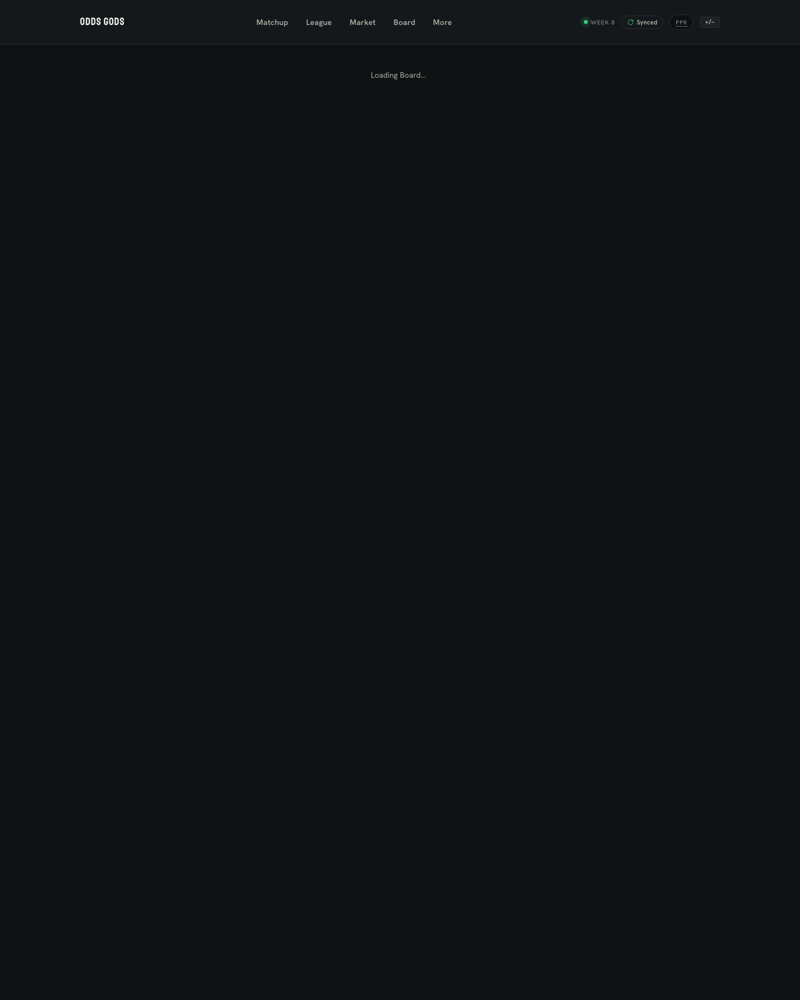

Critique:

- This was a productive failure. The screenshot being stuck on `Loading Board…` proved the harness was not actually waiting for the Sheet surface, so any claim that the merge had been reviewed would have been dishonest.
- The route itself was fine; the capture contract was wrong.

### Sheet view, loop 2

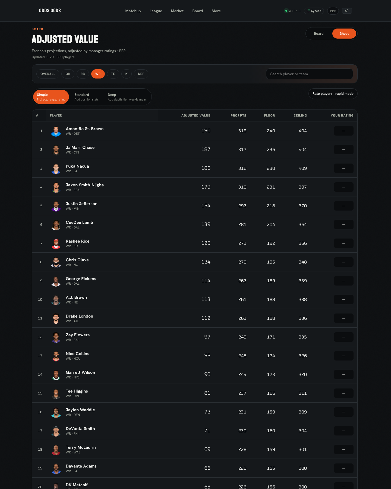

What changed:

- Updated the harness to wait for the Sheet table itself instead of sleeping and hoping the route would be ready.
- The Sheet now reads like a tamed spreadsheet: one sticky player column, one core numeric rhythm, presets instead of checkbox soup, and the rapid-entry affordance pushed into its rightful power-user corner.
- Added the `pick a position above` note for non-simple presets when `Overall` is active, so the table is explicit about why position stats are not shown yet.

Ship call:

- Yes. It now behaves like a serious companion view to the Board, not like the old Projections tab dropped unchanged into a new route.

---

# Design Pass: Frame rebuild + P0 fixes

Date: July 25, 2026
Prompt: `og-handoff-first-pass-2026-07-24`

## Matchup frame (P0-A)

### Before

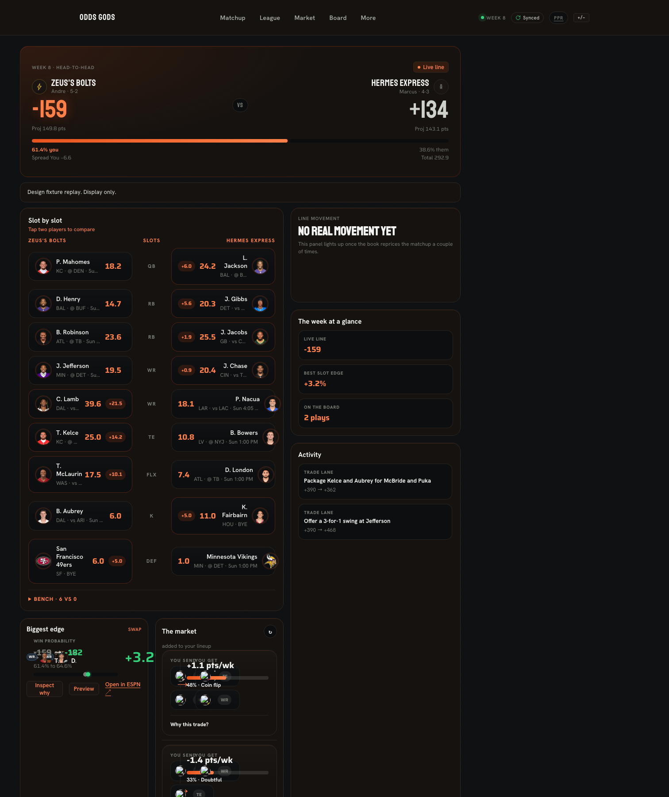

Critique:

- The page root was still a legacy two-column grid (`minmax(0,1fr) 400px`) whose right column rendered nothing, so the whole app sat inside the LEFT 996px of a 1512px viewport with a black void down the right.
- Inside that, `__frame` split again into 596px + 384px, so the slot table lived in a 596px slot: "J. Smith-Njigba"-class names wrapped across lines, metas truncated to "SEA · vs…".
- The rail glance was a junk drawer: LIVE LINE duplicated the hero 500px away, BEST SLOT EDGE duplicated the edge chips, and "1 plays" was both a grammar bug and information-free.
- The Biggest edge card was unreadable: names crushed to "T...." and the +3.2% delta overlapped the strikethrough odds pair.

### After

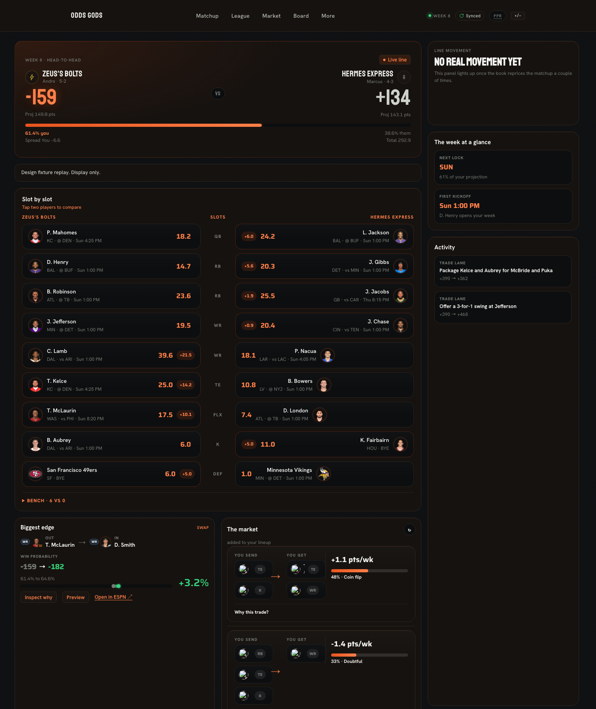

What changed:

- The legacy two-column root is now scoped to the cold-loading skeleton only (`matchup-page--cold`). The loaded page has exactly one split: `.matchup-page__frame` at `minmax(640px,1fr) 384px`, centered in a 1480px wrapper.
- Hero and notices moved inside the main column, so hero + slot table span the full fluid canvas. At 1512px each slot card gets ~480px: zero wrapped starter names, full metas ("KC · @ DEN · Sun 4:25 PM").
- The rail is a true elastic rail: sticky (pins 96px from viewport top, verified by scripted scroll at 0/400/max), fixed modules on top, Activity feed as the flex closer with internal scroll and `align-content: start` so rows keep their natural height.
- Glance rebuilt (P1-D): NEXT LOCK (share of projection locking, from the week-locks data), FIRST KICKOFF (earliest starter kickoff + who), TIGHTEST GAME (the closest other matchup on the board, both payload win%s). Each item hides when its data is absent; the module hides when all three are. The LIVE LINE/BEST SLOT EDGE/"1 plays" boxes are gone.
- Biggest edge card restacked: players row full-width on top, win-probability move + meter below, delta pill in its own fixed slot (26px, tabular). No more overlap at 2-up width.

Critique loop 2 (honest):

- The glance's NEXT LOCK and FIRST KICKOFF can both read "Sun" for teams with no Thu/Fri players; semantically different (share vs. opener) but visually samey. Candidate refinement next pass.
- Market digest cards in the fixture show broken-image fallbacks for placeholder players; real leagues render real headshots. Not chased this pass.
- The design fixture's rail shows only two Activity items so the feed area under them is airy at very tall viewports; real leagues fill it and the internal scroll engages.

## Board false-flag (P0-B)

- Marker logic extracted to `src/utils/myCalls.ts`, the single source: chip renders ONLY for a saved rating ≠ 50; `Number('') < 50` false-flagging is now impossible and locked by tests (`test/myCalls.test.mjs`), including chip-count === My-calls-count and a source-scan that both board surfaces import the shared util and hand-roll nothing.
- Controlled-input regressions (search keystrokes, slider persistence through rerenders) were already covered by `test/boardInteractionLoop.test.mjs`; both pass.

## Market (P0-C + P1-F)

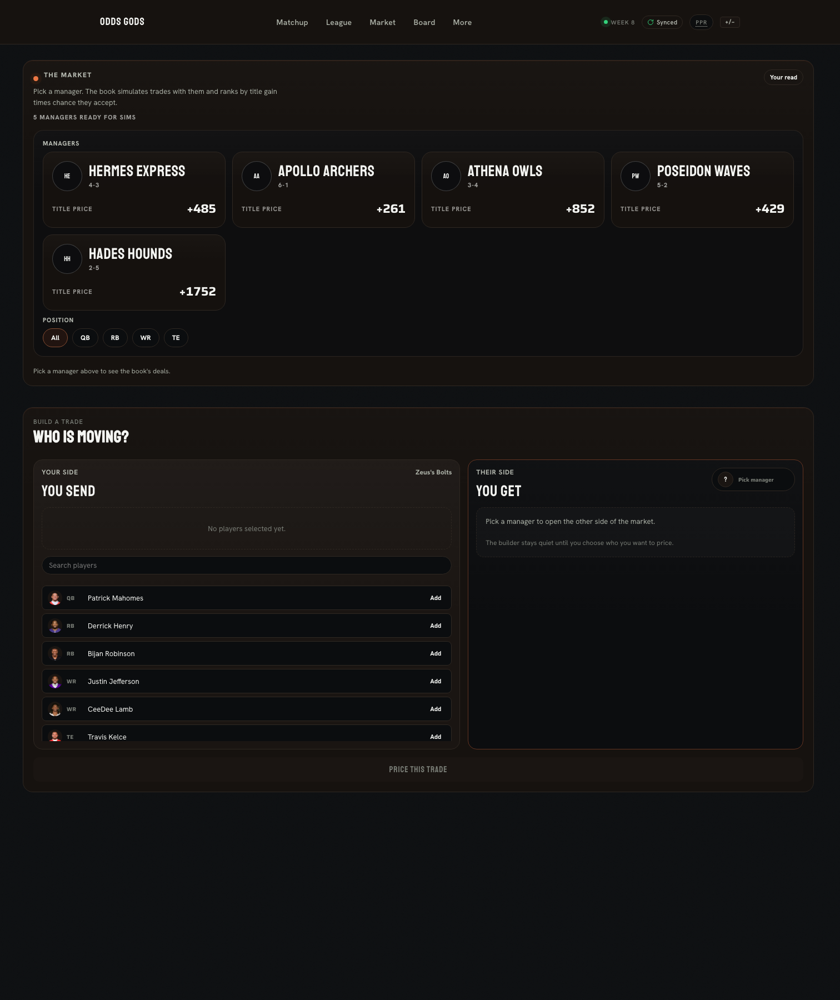

- Scouting is gone: no sub-tab bar, no route, `?view=scouting` lands on Deals (verified: screenshot of the redirect renders identical Deals content). "Your read" and the persona data layer are intact.
- "Your read" is docked in THE MARKET module header instead of floating mid-air.
- MANAGERS / POSITION are now eyebrow labels above their rows, not side labels.
- Manager card names wrap to two lines with a title tooltip instead of colliding with the price (DINK's "FANTASYGODCASTA'S TEAM" case).

## Provenance chip (P1-E)

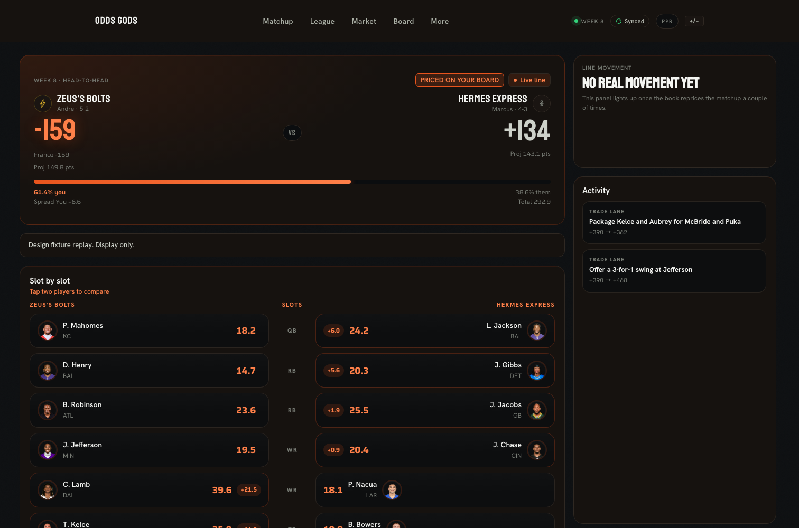
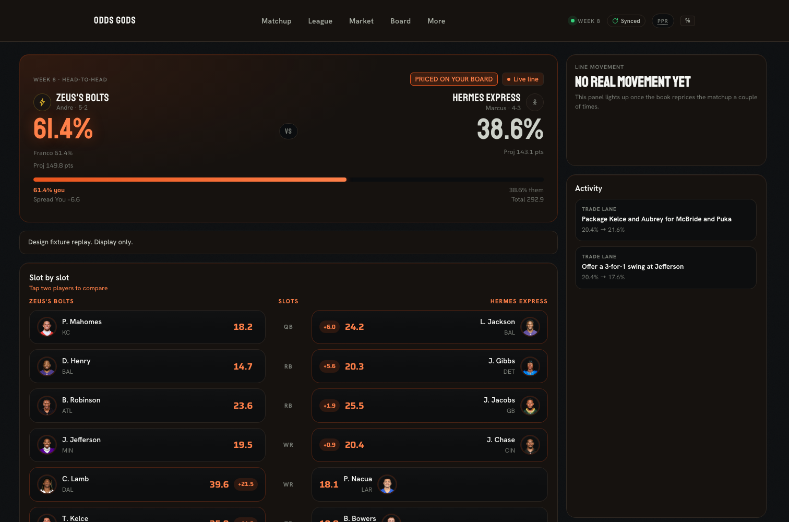

- "PRICED ON YOUR BOARD" chip + "Franco ±X" baseline row verified rendering with a seeded overlay in BOTH odds formats (screenshots above). The Franco number is the server's `house: true` lines payload; nothing is computed client-side.

## Ship call

- Matchup frame, glance, edge card, Board markers, Market composition: yes.
- Not claimed done: live-league (logged-in) verification of the rating save loop end-to-end and the H2H strip against 617 Dynasty; see FRONTEND_DRIFT.md for exactly what still needs Andre's session.

---

# Design Pass: Matchup value sweep

Date: July 25, 2026
Prompt: `og-frontend-sweep-2026-07-25`

## Rail: from passive to actionable

The rail led with Line movement (a chart that says "no real movement yet" most of the week) and ended with Activity. The one genuinely actionable thing on the page, the start/sit call, was buried in the main column below the slot table.

Rail is now ordered by what you can act on:

1. **The call** (top): the recommended sit/start with the win-probability move, the delta, Inspect why / Preview, and a link out to Sleeper or ESPN to actually make the change. Renamed from "Biggest edge" because the module answers a question rather than labelling a metric.
2. **Watch list**: your starters carrying an injury tag, with team and kickoff. Only renders when you have one. This is the widget that replaced "The week at a glance" and it earns its slot: it is per-user, changes week to week, and duplicates nothing else on the page.
3. **Line movement**: demoted, kept.
4. **Activity**: the elastic feed closer, per the rail law.

"The week at a glance" is gone. Its three items were either duplicates or weakly useful; the owner's read was that it did not carry its weight, and re-reading them cold, that was right.

## Slot table

- **Alignment**: the real defect was not left-vs-right, it was that the edge chip only rendered when a side was winning, so the projection column jumped horizontally row to row. The chip now has a reserved fixed column on both sides, so every projection lands on the same x. Verified across all nine rows.
- **Hierarchy**: your projections keep the live orange; the opponent's go muted with a flatter card. Your lineup reads first, the opponent reads as reference. This also pulls accent coverage back toward the 5 to 15% brand rule, which the two-orange-columns version blew past.
- **Opponent is no longer interactive.** Selecting an opponent player was never a start/sit decision you could act on.

## Compare logic

The old rule was "tap any two players." That let you weigh a QB against an RB in a league with no slot that accepts both, and the resulting number came from `buildSyntheticComparison`, a client-side fabricator (see FRONTEND_DRIFT).

The new rule uses the engine's own eligibility data: each of your slots carries the bench players the server says can fill it (`alternatives`). A pair is comparable only when one player starts a slot and the other is listed as an option for that same slot. No position table is invented in the frontend.

Effects:
- Only starters with real bench options are tappable; the slot gutter shows "N options" so you can see where decisions exist before tapping.
- Picking a starter dims every player that cannot be weighed against it, opponent side included.
- The bench drawer opens on pick, so the eligible option is visible instead of hidden behind a collapsed summary.
- Hint copy states how many slots have options, then how many options the pick has.

## Market

Manager cards were oversized: 54px avatars and 30px display type carrying one number each, so nine managers filled a screen and said almost nothing. Cards are now ~196px wide with 30px avatars and 15px names, so a full league fits in one or two rows and the picker stops being the whole page.

## Honest gaps

- The Market is denser but still not *richer*. The owner's note was that it feels dead, and shrinking it does not by itself add value; what would is per-manager signal (their needs, their tendencies, what they have that you want) surfaced before you click. That needs payload work and a design round of its own, and I did not do it this pass.
- The area under the trade builder is still short of the uncapped-closer law at tall viewports.
- Compare eligibility is verified against the design fixture. The live-league case (auth-gated) is unverified, as with prior passes.

---

# Design Pass: Slot table v3

Date: July 25, 2026
Prompt: follow-up on `og-frontend-sweep-2026-07-25`

Owner feedback on v2: orange-as-emphasis is lazy, the bare "+0.3" chips and
gutter "5 options" labels are not intuitive, the reserved chip column leaves
blank space, and you-vs-them is not obvious.

## What changed

- **Blank space closed.** The reserved chip columns are gone. The margin now
  renders under the leading projection as "+5.6 edge", and since every row has
  exactly one leader there is no empty-column state at all. Projections
  right-align to the card edge on your side and mirror on theirs.
- **Self-documenting numbers.** The delta carries its own word ("edge") and
  sits directly under the number it modifies. Green marks the favored side of
  the slot, either side, per the green-equals-favored brand rule; the winner
  card border matches instead of using orange.
- **Options cue moved into the row it describes.** The gutter is back to slot
  labels only. Rows with a real decision show "⇄ N on the bench" in orange at
  the end of the meta line, which is also the tap affordance in words.
- **Hierarchy by structure, not hue.** Projections are no longer orange:
  yours are bright white and heavy, the opponent's dim. Orange is reserved
  for the bench cue; green for edges. Accent coverage drops back toward the
  brand's 5 to 15% band.
- **You-vs-them labeled.** An orange YOU pill sits by your team name, a dim
  THEM pill by the opponent's.

## Verified

Fixture screenshots at 1512px: default and picked states
(`artifacts/design-shots/sweep-2/slot-table-v3*.png`). Picked state confirms
the bench drawer auto-opens with only the eligible option bright, including
its engine-provided resulting line. tsc, brand-check, copy-scan, lint, and
all 40 frontend tests pass.

---

# Design Pass: Plain names, live finder, roster as pieces

Date: July 25, 2026
Prompt: follow-up on `og-frontend-sweep-2026-07-25` (owner voice notes)

## Names say what things are

- "The Market" widget header is now eyebrow "Trade finder" + display headline
  "Find a trade." in the same pattern as the builder's "Who is moving?".
- The matchup rail's "The call" is now "Who do I start?". The mystery-name
  register (the market, the call) is retired for user-facing labels; the book
  voice stays in the copy, not the nouns.

## Engine language out of the UI

- "9 managers ready for sims" is now "9 managers taking calls".
- "The book simulates trades with them and ranks by title gain times chance
  they accept" is now "Pick a manager. The book finds deals they'd actually
  take." Mechanics belong to Franco's docs, not the page.

## The finder sells the tap

- Hovering a manager card flips its "Title price" label to "Find trades" with
  the arrow, in accent orange, so every card advertises what clicking does.

## Roster as pieces, not a list

- The builder's "You send" pool is now grouped by position (QB / RB / WR / TE
  / K / DEF), each group a wrapping grid of compact bubbles: headshot, name,
  position tag. Hover reveals the add affordance; added players hold an
  orange check. Bench players keep their dimmer tone inside each group.
  A whole roster is visible without scrolling a 15-row list.

## Verified

Fixture screenshots: `finder-v2.png` (grouped grid + new header),
`finder-v2-hover.png` (card CTA swap), `matchup-rename.png`. tsc,
brand-check, copy-scan, lint, 40 tests green.
